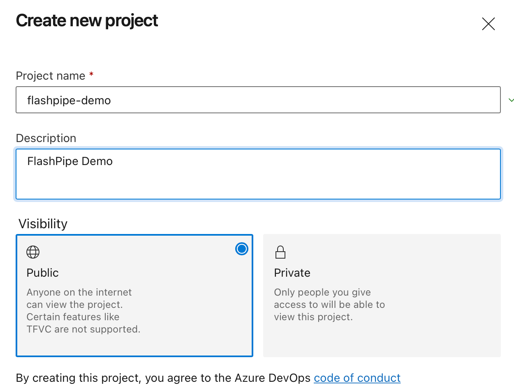
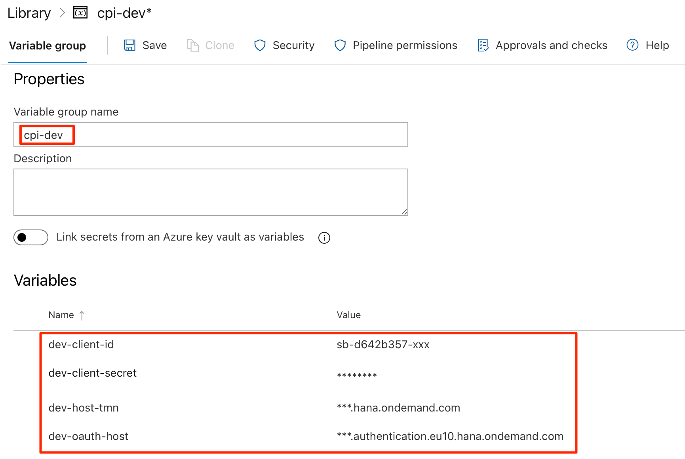
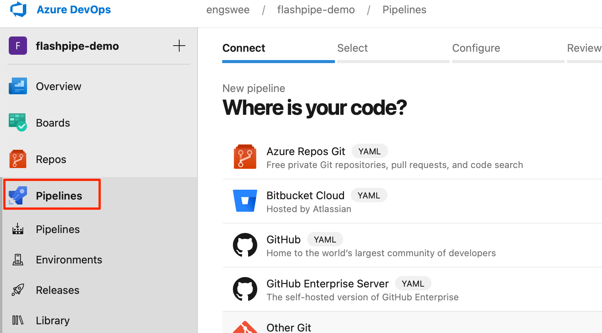
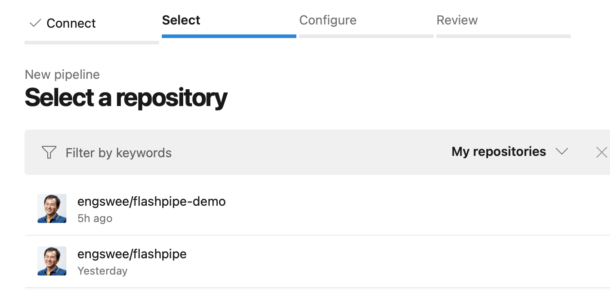
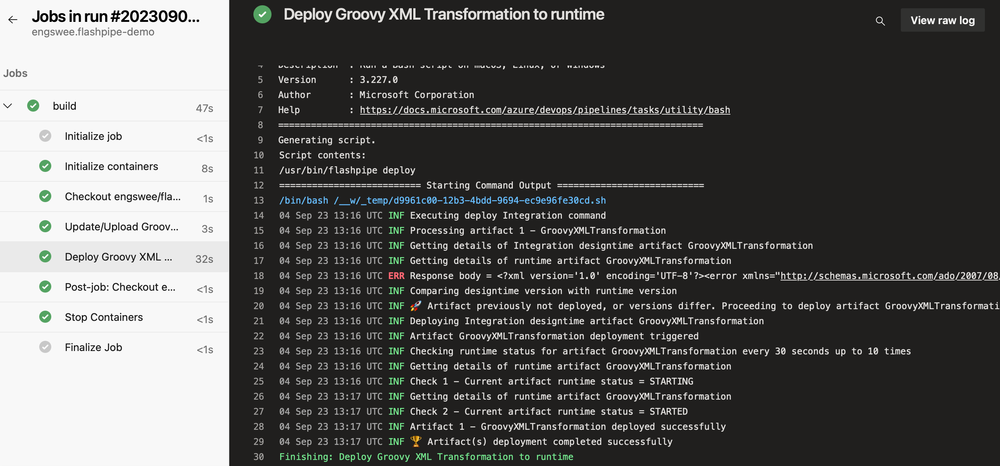

# Upload/Deploy with FlashPipe on Azure Pipelines
The page describes the steps to set up _FlashPipe_ on [Azure Pipelines](https://azure.microsoft.com/en-us/services/devops/pipelines/).

**Note**: [GitHub repository syncing from tenant](github-actions-sync.md) can also be used in place of steps 1 and 2.

### 1. Download and extract content of Integration Flow
Download the content of the Integration Flow from the Cloud Integration tenant.


Extract the content of the downloaded ZIP file.


### 2. Add content to Git repository
Add the contents to a new or existing Git repository.


### 3. Add pipeline configuration YAML
Add a [pipeline configuration YAML file](https://docs.microsoft.com/en-us/azure/devops/pipelines/get-started/pipelines-get-started?view=azure-devops#define-pipelines-using-yaml-syntax) (`azure-pipelines.yml`) in the root directory of the Git repository.

#### Template YAML with steps to create/update and deploy one integration artifact
```yaml
trigger:
  - <branch_name>

pool:
  vmImage: 'ubuntu-latest'

variables:
  - group: <variable_group_name>

resources:
  containers:
    - container: flashpipe
      image: engswee/flashpipe:<flashpipe_version>

jobs:
  - job: build
    container: flashpipe
    steps:
      # Upload/Update design time artifact
      - bash: flashpipe update artifact
        env:
          FLASHPIPE_TMN_HOST: $(dev-host-tmn)
          FLASHPIPE_TMN_USERID: $(dev-user) # When using Basic authentication
          FLASHPIPE_TMN_PASSWORD: $(dev-password) # When using Basic authentication
          FLASHPIPE_OAUTH_HOST: $(dev-oauth-host) # When using OAuth authentication
          FLASHPIPE_OAUTH_PATH: <oauth_path> # Optional
          FLASHPIPE_OAUTH_CLIENTID: $(dev-client-id) # When using OAuth authentication
          FLASHPIPE_OAUTH_CLIENTSECRET: $(dev-client-secret) # When using OAuth authentication
          FLASHPIPE_ARTIFACT_ID: <artifact_id>
          FLASHPIPE_ARTIFACT_NAME: <artifact_name>
          FLASHPIPE_PACKAGE_ID: <package_id>
          FLASHPIPE_PACKAGE_NAME: <package_name>
          FLASHPIPE_DIR_ARTIFACT: <artifact_dir>
          FLASHPIPE_FILE_PARAM: <param_file> # Optional
          FLASHPIPE_FILE_MANIFEST: <manifest_file> # Optional
          FLASHPIPE_DIR_WORK: <working_directory> # Optional
          FLASHPIPE_SCRIPT_COLLECTION_MAP: <comma_separated_source/target_pairs> # Optional
          FLASHPIPE_ARTIFACT_TYPE: <artifact_type> # Optional
          FLASHPIPE_PACKAGE_FILE: <package_file> # Optional
      # Deploy to runtime
      - bash: flashpipe deploy
        env:
          FLASHPIPE_TMN_HOST: $(dev-host-tmn)
          FLASHPIPE_TMN_USERID: $(dev-user) # When using Basic authentication
          FLASHPIPE_TMN_PASSWORD: $(dev-password) # When using Basic authentication
          FLASHPIPE_OAUTH_HOST: $(dev-oauth-host) # When using OAuth authentication
          FLASHPIPE_OAUTH_PATH: <oauth_path> # Optional
          FLASHPIPE_OAUTH_CLIENTID: $(dev-client-id) # When using OAuth authentication
          FLASHPIPE_OAUTH_CLIENTSECRET: $(dev-client-secret) # When using OAuth authentication
          FLASHPIPE_ARTIFACT_IDS: <artifact_ids>
          FLASHPIPE_DELAY_LENGTH: <delay_in_seconds> # Optional
          FLASHPIPE_MAX_CHECK_LIMIT: <max_check_limit> # Optional
          FLASHPIPE_COMPARE_VERSIONS: <compare_versions> # Optional
          FLASHPIPE_ARTIFACT_TYPE: <artifact_type> # Optional
```
Where:
- `<branch_name>` - branch name of Git repository that will automatically trigger pipeline
- `<variable_group_name>` - name of Azure Pipeline variable group that stores environment variables for access to Cloud Integration tenant - `$(dev-host-tmn), $(dev-user), $(dev-password)`. Further explanation in step 5
- `<flashpipe_version>` - version of _FlashPipe_

**Note**: Environment variables are mapped to the script's execution environment using the `env:` keyword.

#### Example (using OAuth authentication for Cloud Foundry)

```yaml
trigger:
  - main

pool:
  vmImage: 'ubuntu-latest'

variables:
  - group: cpi-dev

resources:
  containers:
    - container: flashpipe
      image: engswee/flashpipe:3.2.0

jobs:
  - job: build
    container: flashpipe
    steps:
      # Upload/Update design time artifact
      - bash: flashpipe update artifact
        displayName: 'Update/Upload Groovy XML Transformation to design time'
        env:
          FLASHPIPE_TMN_HOST: $(dev-host-tmn)
          FLASHPIPE_OAUTH_HOST: $(dev-oauth-host)
          FLASHPIPE_OAUTH_CLIENTID: $(dev-client-id)
          FLASHPIPE_OAUTH_CLIENTSECRET: $(dev-client-secret)
          FLASHPIPE_ARTIFACT_ID: GroovyXMLTransformation
          FLASHPIPE_ARTIFACT_NAME: "Groovy XML Transformation"
          FLASHPIPE_PACKAGE_ID: FlashPipeDemo
          FLASHPIPE_PACKAGE_NAME: "FlashPipe Demo"
          FLASHPIPE_DIR_ARTIFACT: "$(Build.SourcesDirectory)/FlashPipe Demo/Groovy XML Transformation"
      # Deploy to runtime
      - bash: flashpipe deploy
        displayName: 'Deploy Groovy XML Transformation to runtime'
        env:
          FLASHPIPE_TMN_HOST: $(dev-host-tmn)
          FLASHPIPE_OAUTH_HOST: $(dev-oauth-host)
          FLASHPIPE_OAUTH_CLIENTID: $(dev-client-id)
          FLASHPIPE_OAUTH_CLIENTSECRET: $(dev-client-secret)
          FLASHPIPE_ARTIFACT_IDS: GroovyXMLTransformation
```

For more advanced configuration with multiple artifacts and multiple environments, an example can be found [here](https://github.com/engswee/flashpipe-demo/blob/azure-pipelines/azure-pipelines.yml).

### 4. Create new project in Azure DevOps


### 5. Create Variable Group
Variables can be stored securely on Azure Pipelines using a [Variable Group](https://docs.microsoft.com/en-us/azure/devops/pipelines/library/variable-groups?view=azure-devops&tabs=yaml). These can then be passed to the pipeline steps as environment variables. For _FlashPipe_, we will use these to securely store the details to access the Cloud Integration tenant.

Create a new Variable Group under `Pipelines > Library`. Use the same name as defined in the `variables` section of the YAML, e.g. `cpi-dev`


**Basic Authentication**

Add the following three variables in the group.
1. `dev-host-tmn` - base URL for tenant management node of Cloud Integration (excluding the https:// prefix)
2. `dev-user` - user ID for Cloud Integration
3. `dev-password` - password for above user ID
   

**OAuth Authentication**

Add the following four variables in the group. Refer to [OAuth client setup page](oauth_client.md) for details on setting up the OAuth client for usage with _FlashPipe_.
1. `dev-host-tmn` - base URL for tenant management node of Cloud Integration (excluding the https:// prefix)
2. `dev-oauth-host` - host name for OAuth authentication server
3. `dev-client-id` - OAuth client ID
4. `dev-client-secret` - OAuth client secret
   

**Note**: For the password and client secret (and optionally the user ID), it can be stored securely as a secret instead of plain text by clicking the padlock button on its right.

### 6. Create new pipeline based on Git repository
Next, move on to create a new pipeline in the Azure DevOps project.


Select the Git repository to be used in the pipeline.


Since the pipeline YAML file is already created in the repository, it will be loaded. Review it and then select `Run` to execute the pipeline.


### 7. Check pipeline run
Once the run is triggered, you can monitor its execution and job logs.

**Note**: On the first run of the pipeline, you may be asked to approve access to the Variable Group from the pipeline.

Upon completion of the run, you can review the logs, and also check the artifact (designtime and runtime) in the Cloud Integration tenant.
