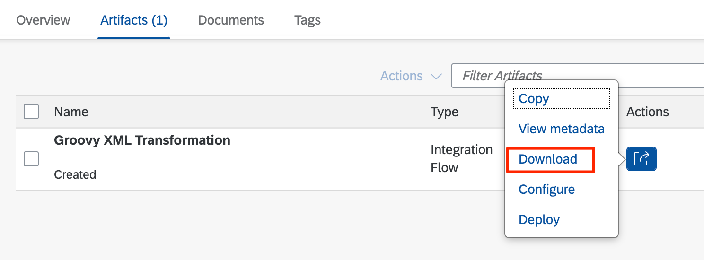
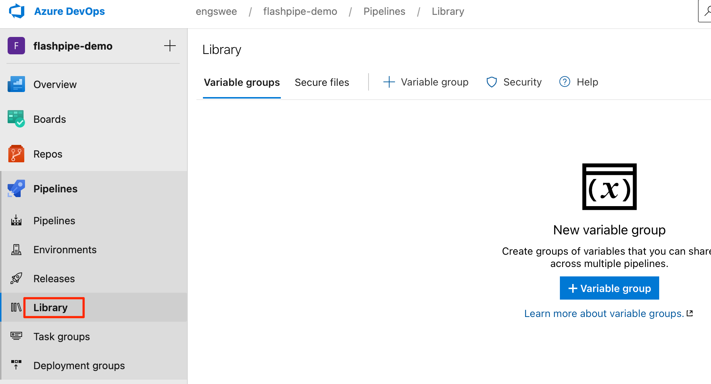
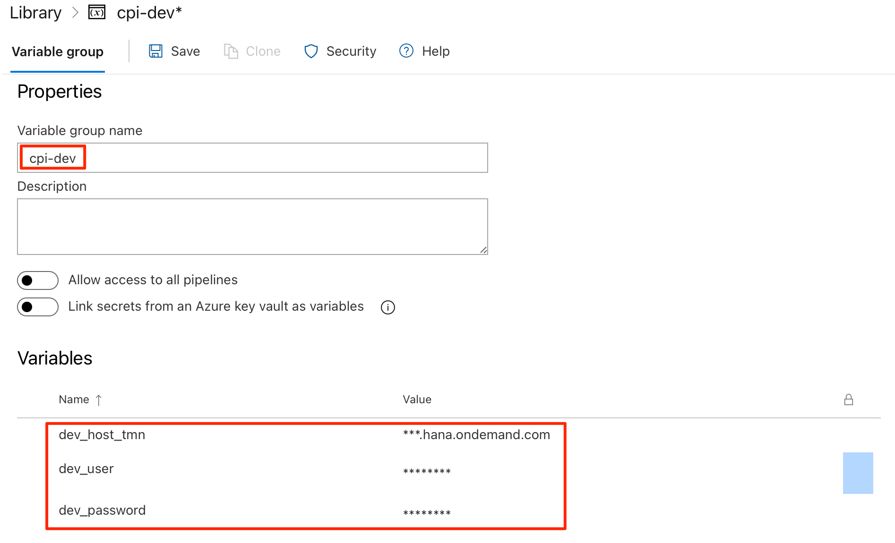
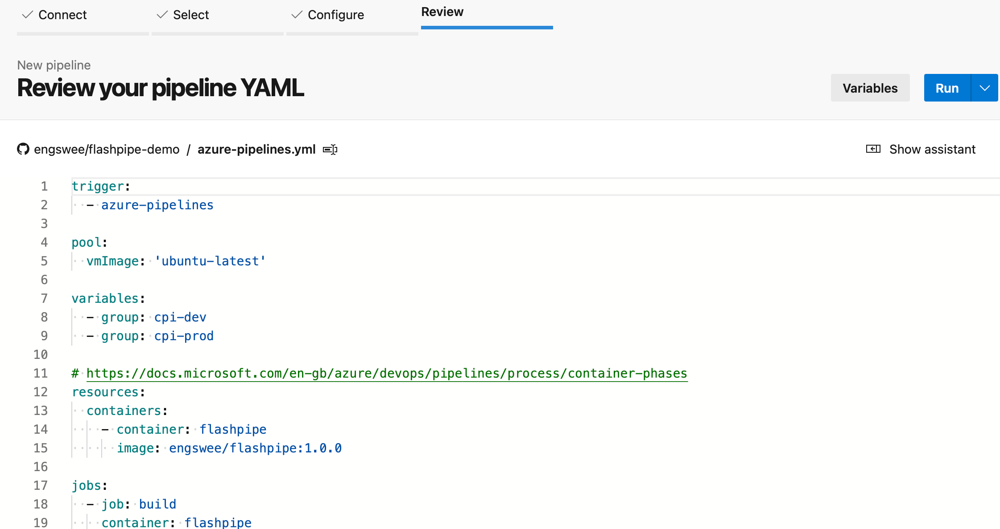
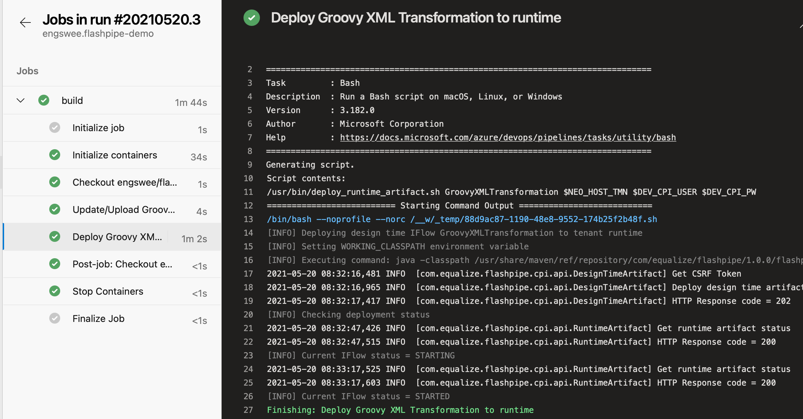

# Setting Up FlashPipe on Azure Pipelines
The page describes the steps to set up _FlashPipe_ on Azure Pipelines.

### 1. Download and extract content of Integration Flow
Download the content of the Integration Flow from the Cloud Integration tenant.


Extract the content of the downloaded ZIP file


### 2. Add content to Git repository
Add the contents to a new or existing Git repository. 


### 3. Add Maven POM for unit testing [Optional]
If you intend to execute unit testing using Maven, add a Maven POM file (`pom.xml`) to the Git repository with the appropriate content.

_FlashPipe_'s Maven repository comes loaded with the following libraries (and any dependencies), so you can gain advantage of faster execution time by running in offline mode `mvn test -o`.
- org.codehaus.groovy:groovy-all:2.4.21
- org.spockframework:spock-core:1.3-groovy-2.4
- org.apache.camel:camel-core:2.24.2
- org.apache.httpcomponents.client5:httpclient5:5.0.4
- org.apache.logging.log4j:log4j-api:2.14.1
- org.apache.logging.log4j:log4j-core:2.14.1
- org.apache.logging.log4j:log4j-slf4j-impl:2.14.1
- net.bytebuddy:byte-buddy:1.11.0

For multiple integration packages/artifacts, the repository can be structured as a Maven multi-module project. An example can be found [here](https://github.com/engswee/flashpipe-demo/tree/azure-pipelines).

### 4. Add pipeline configuration YAML
Add a pipeline configuration YAML file (`azure-pipelines.yml`) in the root directory of the Git repository.

#### Template YAML with steps to create/update and deploy one integration artifact
```yaml
trigger:
  - <branch_name>

pool:
  vmImage: 'ubuntu-latest'

variables:
  - group: <variable_group_name>

resources:
  containers:
    - container: flashpipe
      image: engswee/flashpipe:<flashpipe_version>

jobs:
  - job: build
    container: flashpipe
    steps:
      # Upload/Update design time
      - bash: /usr/bin/update_designtime_artifact.sh <working_dir> $DEV_HOST_TMN $DEV_CPI_USER $DEV_CPI_PW <artifact_id> <artifact_name> <package_id> <package_name> <git_src_dir>
        env:
          DEV_CPI_USER: $(dev_user)
          DEV_CPI_PW: $(dev_password)
      # Deploy runtime
      - bash: /usr/bin/deploy_runtime_artifact.sh <artifact_id> $DEV_HOST_TMN $DEV_CPI_USER $DEV_CPI_PW
        env:
          DEV_CPI_USER: $(dev_user)
          DEV_CPI_PW: $(dev_password)
```
Where:
- `<branch_name>` - branch name of Git repository that will automatically trigger pipeline
- `<variable_group_name>` - name of Azure Pipeline variable group that stores environment variables for access to Cloud Integration tenant - `$DEV_HOST_TMN, $(dev_user), $(dev_password)`. Further explanation below
- `<flashpipe_version>` - version of _FlashPipe_

#### Example

```yaml
trigger:
  - main

pool:
  vmImage: 'ubuntu-latest'

variables:
  - group: cpi-dev

resources:
  containers:
    - container: flashpipe
      image: engswee/flashpipe:1.0.0

jobs:
  - job: build
    container: flashpipe
    steps:
      # Upload/Update design time
      - bash: /usr/bin/update_designtime_artifact.sh /tmp $DEV_HOST_TMN $DEV_CPI_USER $DEV_CPI_PW GroovyXMLTransformation "Groovy XML Transformation" FlashPipeDemo "FlashPipe Demo" "$(Build.SourcesDirectory)/FlashPipe Demo/Groovy XML Transformation" --debug
        displayName: 'Update/Upload Groovy XML Transformation to design time'
        env:
          DEV_CPI_USER: $(dev_user)
          DEV_CPI_PW: $(dev_password)
      # Deploy runtime
      - bash: /usr/bin/deploy_runtime_artifact.sh GroovyXMLTransformation $DEV_HOST_TMN $DEV_CPI_USER $DEV_CPI_PW
        displayName: 'Deploy Groovy XML Transformation to runtime'
        env:
          DEV_CPI_USER: $(dev_user)
          DEV_CPI_PW: $(dev_password)
```

For more advanced configuration with multiple artifacts and multiple environments, an example can be found [here](https://github.com/engswee/flashpipe-demo/blob/azure-pipelines/azure-pipelines.yml).

### 5. Create new project in Azure DevOps


### 6. Create Variable Group
Variables can be stored securely on Azure Pipelines using a Variable Group. These can then be passed to the pipeline steps as environment variables. For FlashPipe, we will use these to securely store the details to access the Cloud Integration tenant.

Add a new Variable Group under `Pipelines > Library`.


Add the following three variables in the group.
1. `dev_host_tmn` - base URL for tenant management node of Cloud Integration (excluding the https:// prefix)
2. `dev_user` - user ID for Cloud Integration
3. `dev_password` - password for above user ID

**Note**: For the password (and optionally the user ID), it can be stored securely as a secret instead of plain text by clicking the padlock button on its right.

### 7. Create new pipeline based on Git repository
Next, move on to create a new pipeline in the Azure DevOps project.


Select the Git repository to be used in the pipeline.


Since the pipeline YAML file is already created in the repository, it will be loaded. Review it and then select `Run` to execute the pipeline.


### 8. Check pipeline run
Once the run is triggered, you can monitor its execution and job logs.

**Note**: On the first run of the pipeline, you may be ask to approve access to the Variable Group from the pipeline.

Upon completion of the run, you can review the logs, and also check the artifact (designtime and runtime) in the Cloud Integration tenant.
