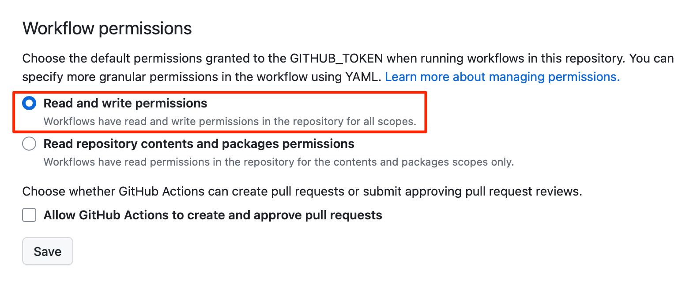
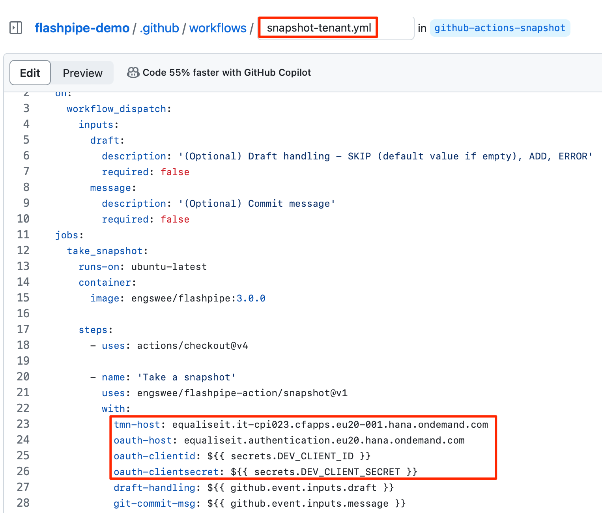
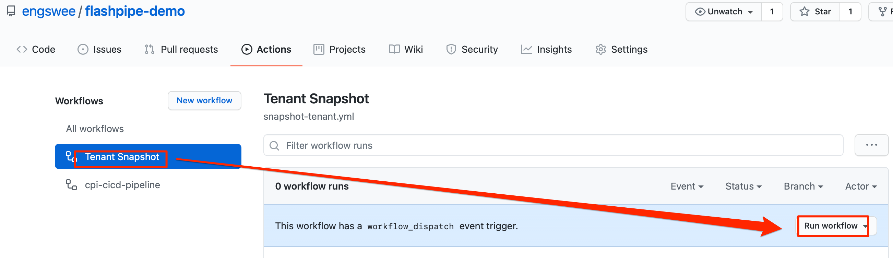
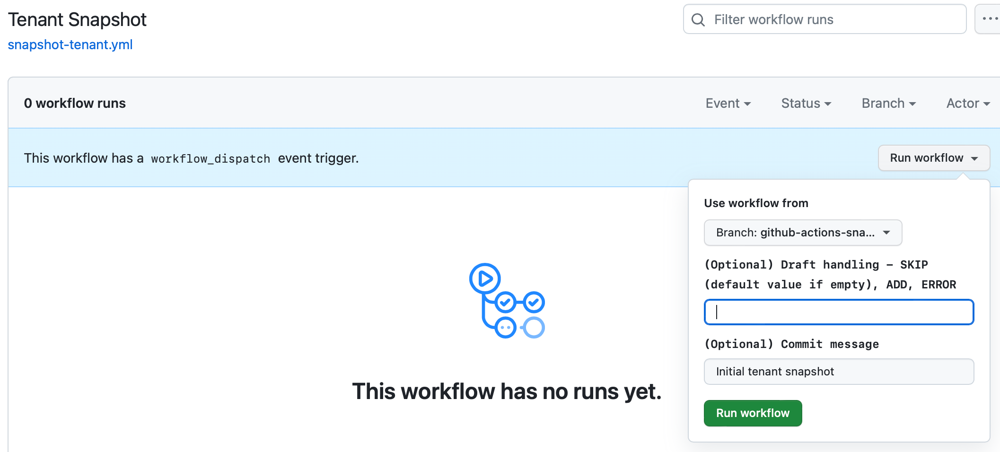
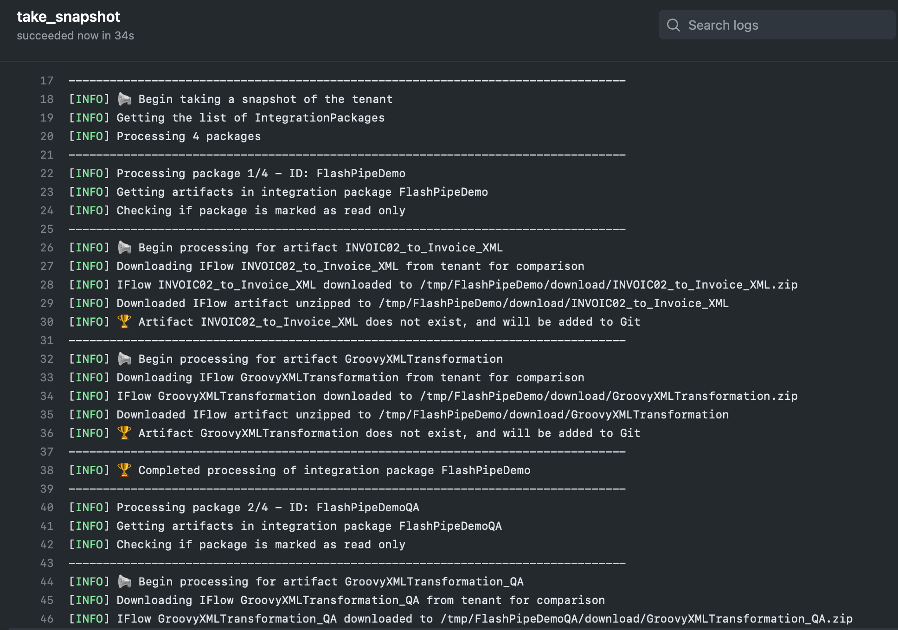
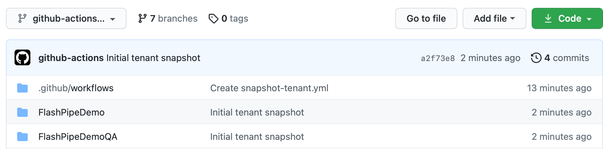
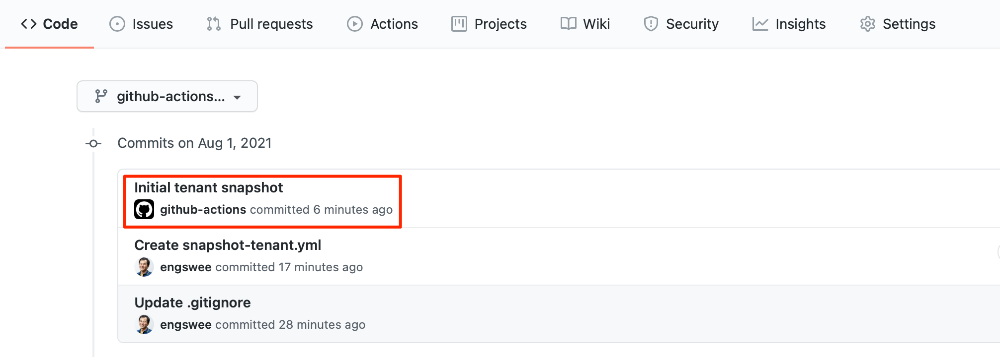
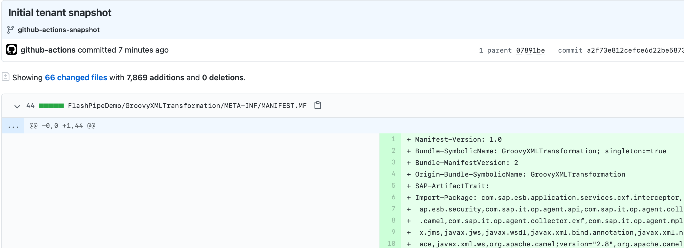
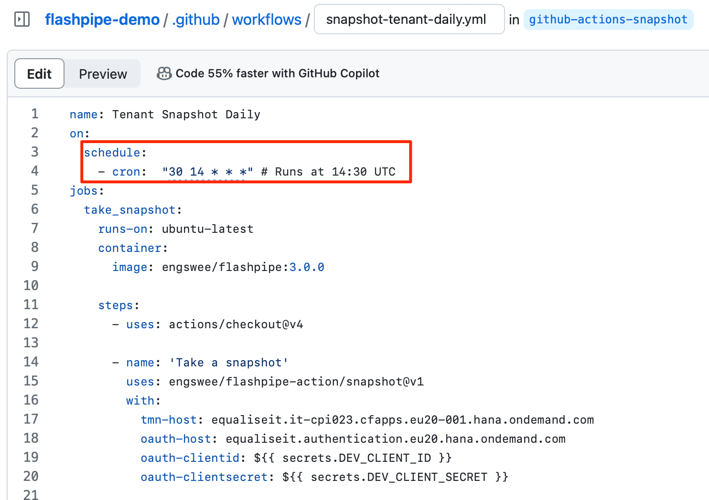

# Snapshot Tenant to GitHub with FlashPipe on GitHub Actions
The page describes the steps to set up _FlashPipe_ on [GitHub Actions](https://github.com/features/actions) to snapshot contents of a Cloud Integration tenant to a GitHub repository.

### 1. Create GitHub repository
Create (or use) an existing repository on GitHub.

Ensure that the repository includes the following files at the root directory. The links provide samples for each file that can be used.

- [.gitignore](https://github.com/engswee/flashpipe-demo/blob/github-actions-snapshot/.gitignore) - ensures unwanted files are not included in commits
- [.gitattributes](https://github.com/engswee/flashpipe-demo/blob/github-actions-snapshot/.gitattributes) - ensures correct line endings for committed files

### 2. Create secrets in GitHub repository
Sensitive information can be stored securely on GitHub using [encrypted secrets](https://docs.github.com/en/actions/reference/encrypted-secrets). These can then be passed to the pipeline steps as environment variables. For _FlashPipe_, we will use these to securely store the details to access the Cloud Integration tenant.

In the GitHub repository, go to `Settings` > `Secrets` to create new repository secrets as shown below.

**Basic Authentication**

Create the following repository secrets.
1. `DEV_USER_ID` - user ID for Cloud Integration
2. `DEV_PASSWORD` - password for above user ID
   

**OAuth Authentication**

Create the following repository secrets. Refer to [OAuth client setup page](oauth_client.md) for details on setting up the OAuth client for usage with _FlashPipe_.
1. `DEV_CLIENT_ID` - OAuth client ID
2. `DEV_CLIENT_SECRET` - OAuth client secret
   

**Note**: GitHub does not provide functionality to store unencrypted plain text variables, which would be useful for values like the base URLs. Optionally, these can be stored as encrypted secrets instead of being hardcoded in the YAML configuration file.

### 3. Configure workflow permissions
In order for the workflows to be able to make changes to the repository, correct permissions need to be configured.

In the GitHub repository, go to `Settings` > `Actions` > `General`. Scroll down to the `Workflow permissions` section and select `Read and write permissions` and click `Save`.

### 4. Create GitHub Actions workflow
In the GitHub repository, go to `Actions` to create new workflow.

Skip the templates and choose `set up a workflow yourself`.

Provide a suitable name for the workflow file e.g. `snapshot-tenant.yml` and replace the default content with the code sample below. Replace the tenant and authentication details accordingly.

**NOTE** - FlashPipe comes with companion GitHub Action [engswee/flashpipe-action](https://github.com/engswee/flashpipe-action) that simplifies usage in a workflow. The following action is used in the workflow:
- [engswee/flashpipe-action/snapshot@v1](https://github.com/engswee/flashpipe-action#snapshot)

Save and commit the new workflow file.

### 5. Trigger workflow execution
This workflow has been configured with `on: workflow_dispatch` event triggering which allows it to be executed manually.

In the GitHub repository, go to `Actions`, select the workflow and click `Run workflow`.

[Optional] Provide input details for the workflow execution.

### 6. View execution results
During or upon completion of the workflow run, the logs can be viewed by clicking on the workflow run.

The IFlow files have now been downloaded from the tenant and committed to the repository.

The changes can be viewed from the commit history.

Click on the particular commit to review details of the changes.

### 7. [Optional] Create workflow for executing snapshot on a periodic schedule
Once the initial Git repository has been populated, additional workflow can be created to snapshot the tenant on a periodic schedule.

Create a new workflow file in the `.github/workflow` directory. Populate the content with the code sample below. Replace the tenant and authentication details accordingly. Then, save and commit the file.

This workflow has the following triggering event:
- `on: schedule` - executed periodically based on a cron schedule (refer to [crontab guru](https://crontab.guru) for help in generation of the cron syntax)

When it reaches the period configured in the schedule, the workflow will be executed. If there are no differences between the tenant content and the Git repository, no changes will be committed.