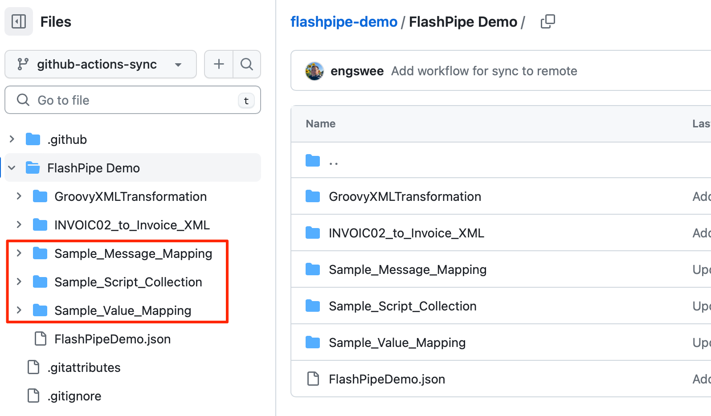
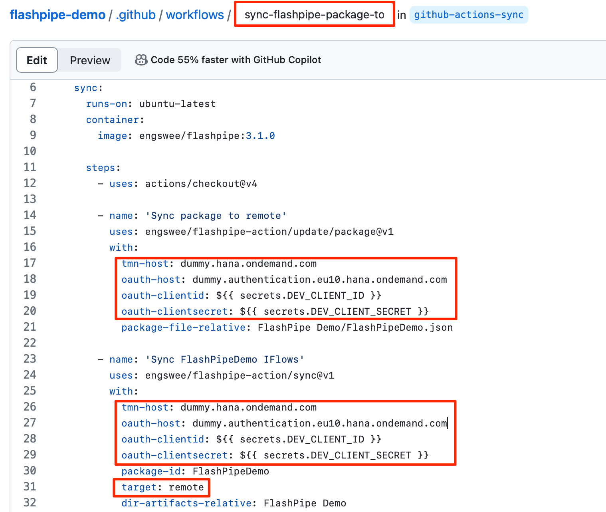
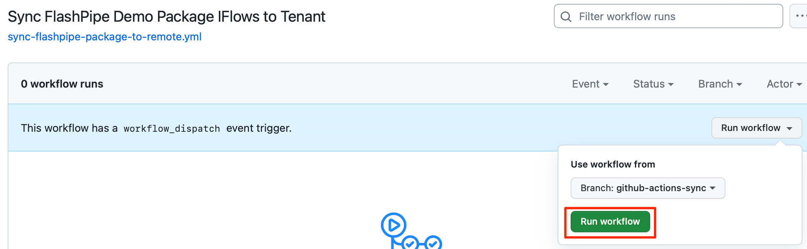
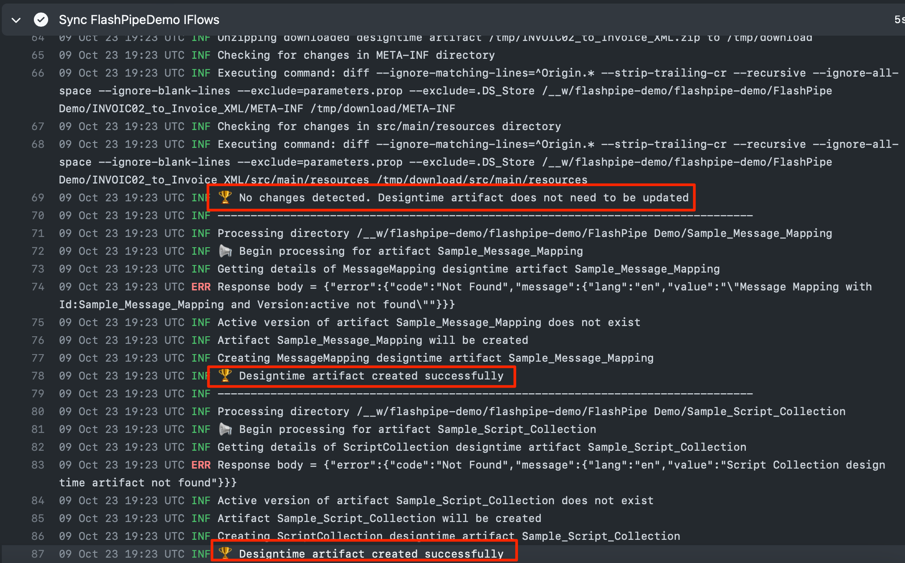

# Sync from GitHub to Tenant with FlashPipe on GitHub Actions
The page describes the steps to set up _FlashPipe_ on [GitHub Actions](https://github.com/features/actions) to sync artifacts from a GitHub repository to a Cloud Integration tenant.

**NOTE** - The [`sync`](flashpipe-cli.md#4-sync) command allows 1-to-1 update of _multiple_ artifacts to the tenant, compared to the [`update artifact`](flashpipe-cli.md#1-update-artifact) command which only updates 1 artifact at a time (but with more configurable options).

### Prerequisite
An existing GitHub repository already exists with artifact contents already stored in the repository. The steps to create this can be found in [Sync designtime artifacts from Tenant to GitHub using GitHub Actions](github-actions-sync.md).

In the following example, the repository now contains new content for the other artifact types as highlighted below.

### 1. Create GitHub Actions workflow
In the GitHub repository, go to `Actions` to create new workflow.

Skip the templates and choose `set up a workflow yourself`.

Provide a suitable name for the workflow file e.g. `sync-flashpipe-package-to-remote.yml` and replace the default content with the code sample below. Replace the tenant and authentication details accordingly.

**NOTE** - FlashPipe comes with companion GitHub Action [engswee/flashpipe-action](https://github.com/engswee/flashpipe-action) that simplifies usage in a workflow. The following actions are used in the workflow:
- [engswee/flashpipe-action/update/package@v1](https://github.com/engswee/flashpipe-action#update-package) - this is an optional step in case the integration package does not exist in the tenant and needs to be created first. It can also be used to update the details of the integration package.
- [engswee/flashpipe-action/sync@v1](https://github.com/engswee/flashpipe-action#sync) - the new parameter `target: remote` controls the direction of the sync from `local`(GitHub repository) to `remote`(tenant).

Save and commit the new workflow file.

### 2. Trigger workflow execution
This workflow has been configured with `on: workflow_dispatch` event triggering which allows it to be executed manually.

In the GitHub repository, go to `Actions`, select the workflow and click `Run workflow`.

### 3. View execution results

During or upon completion of the workflow run, the logs can be viewed by clicking on the workflow run.

As seen from the logs, there are no changes to the integration flow, so it is not updated to the tenant. However, the new contents in the GitHub repository have been synced and these artifacts were created on the tenant. 