# Sync to GitHub with FlashPipe on GitHub Actions
The page describes the steps to set up _FlashPipe_ on [GitHub Actions](https://github.com/features/actions) to sync IFlows from a Cloud Integration tenant to a GitHub repository.

### 1. Create GitHub repository
Create (or use) and existing repository on GitHub.

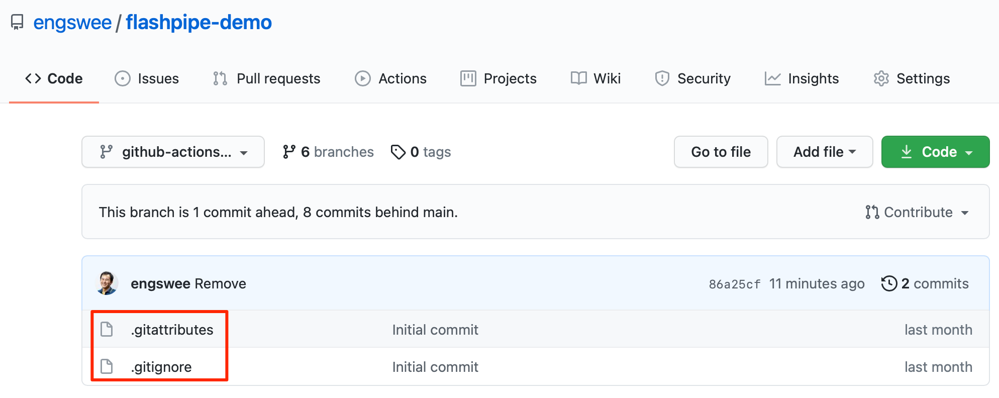
Ensure that the repository includes the following files at the root directory. The links provide samples for each file that can be used.

- [.gitignore](https://github.com/engswee/flashpipe-demo/blob/github-actions-sync/.gitignore) - ensures unwanted files are not included in commits
- [.gitattributes](https://github.com/engswee/flashpipe-demo/blob/github-actions-sync/.gitattributes) - ensures correct line endings for commited files

### 2. Create secrets in GitHub repository
Sensitive information can be stored securely on GitHub using [encrypted secrets](https://docs.github.com/en/actions/reference/encrypted-secrets). These can then be passed to the pipeline steps as environment variables. For _FlashPipe_, we will use these to securely store the details to access the Cloud Integration tenant.

In the GitHub repository, go to `Settings` > `Secrets` to create new repository secrets as shown below.
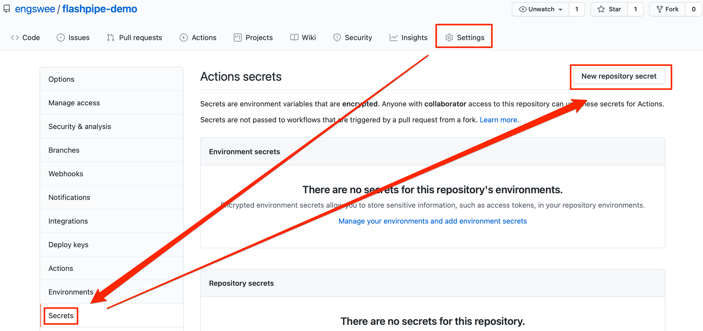

**Basic Authentication**

Create the following repository secrets.
1. `DEV_USER_ID` - user ID for Cloud Integration
2. `DEV_PASSWORD` - password for above user ID
   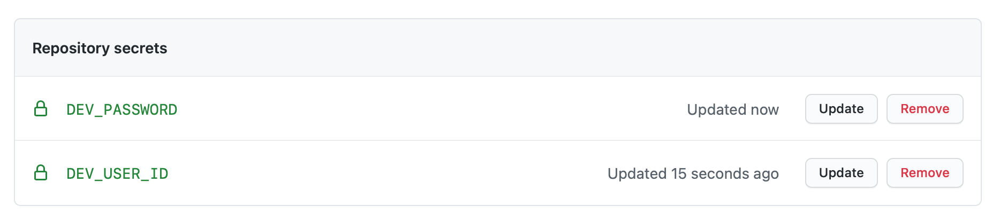

**OAuth Authentication**

Create the following repository secrets.
1. `DEV_CLIENT_ID` - OAuth client ID
2. `DEV_CLIENT_SECRET` - OAuth client secret
   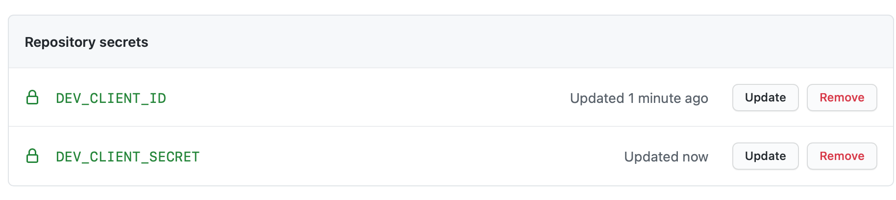

**Note**: GitHub does not provide functionality to store unencrypted plain text variables, which would be useful for values like the base URLs. Optionally, these can be stored as encrypted secrets instead of being hardcoded in the YAML configuration file.

### 3. Create .github/workflows directory
In the GitHub repository, go to `Actions` to create new workflow.
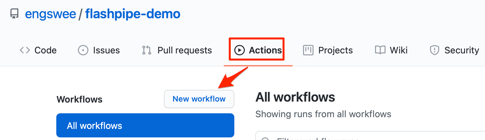

Skip the templates and choose `set up a workflow yourself`.

Provide a suitable name for the workflow file e.g. `sync-any-iflows.yml` and replace the default content with the code sample below. Replace the tenant and authentication details accordingly.
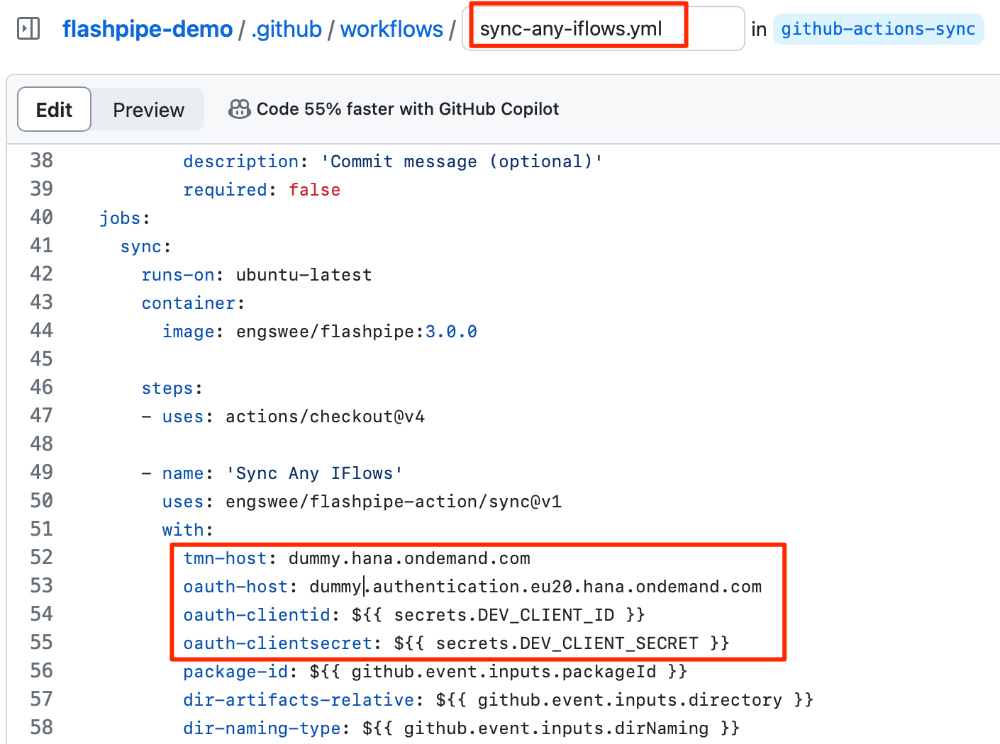

Save and commit the new workflow file.

### 4. Trigger workflow execution
This workflow has been configured with `on: workflow_dispatch` event triggering which allows it to be executed manually.

In the GitHub repository, go to `Actions`, select the workflow and click `Run workflow`.
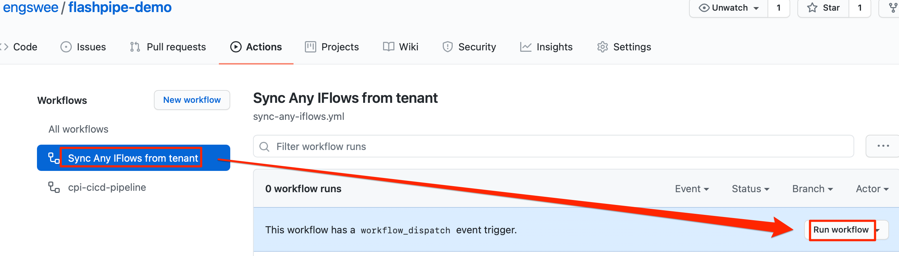

Provide input details for the workflow execution. The mandatory fields are the Integration Package ID and target directory (for the package) to store the content in the repository. 
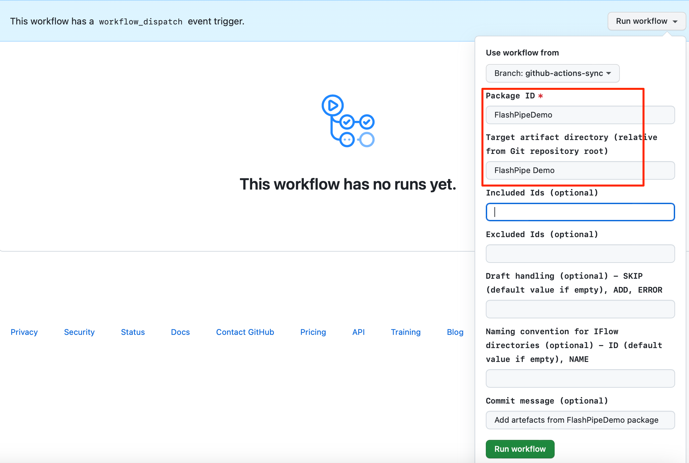

### 5. View execution results
During or upon completion of the workflow run, the logs can be viewed by clicking on the workflow run.
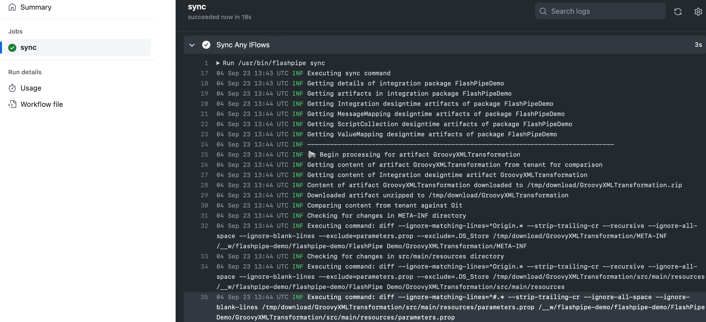

The IFlow files have now been downloaded from the tenant and committed to the repository.
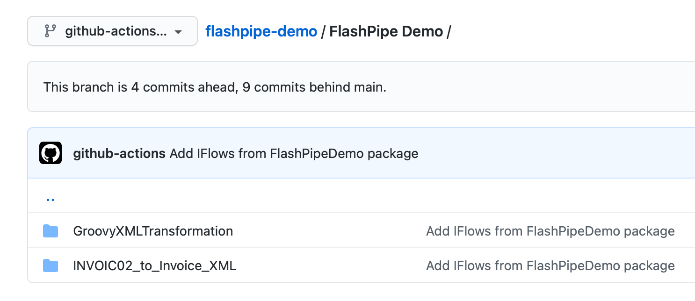

The changes can be viewed from the commit history.
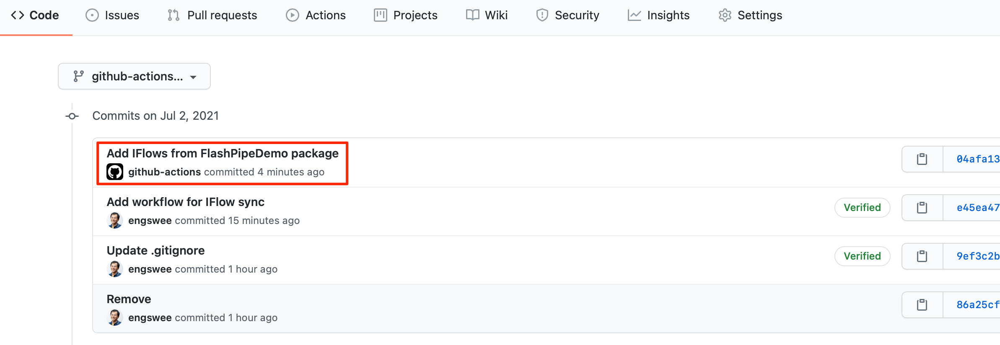

Click on the particular commit to review details of the changes.
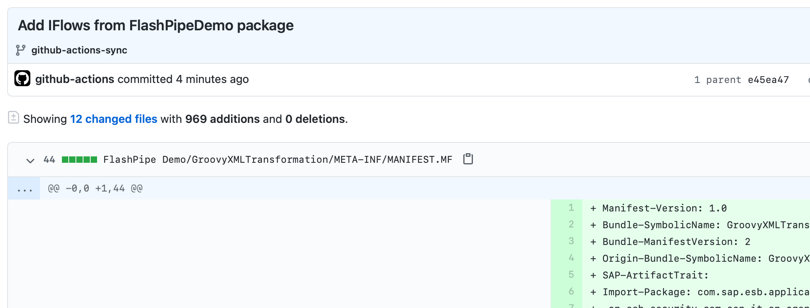

### 6. [Optional] Create workflows for syncing specific content manually or scheduled
Once the initial Git repository has been populated, additional workflows can be created to sync specific content. These can be executed on a periodic schedule or on an adhoc basis.

Create a new workflow file in the `.github/workflow` directory. Populate the content with the code sample below. Save and commit the file.

This workflow has been hardcoded with specific values for `GIT_SRC_DIR` and `PACKAGE_ID`. It also has two triggering events
- `on: workflow_dispatch` - which allows it to be executed manually
- `on: schedule` - executes periodically based on a cron schedule (refer to [crontab guru](https://crontab.guru) to help generate the cron syntax)

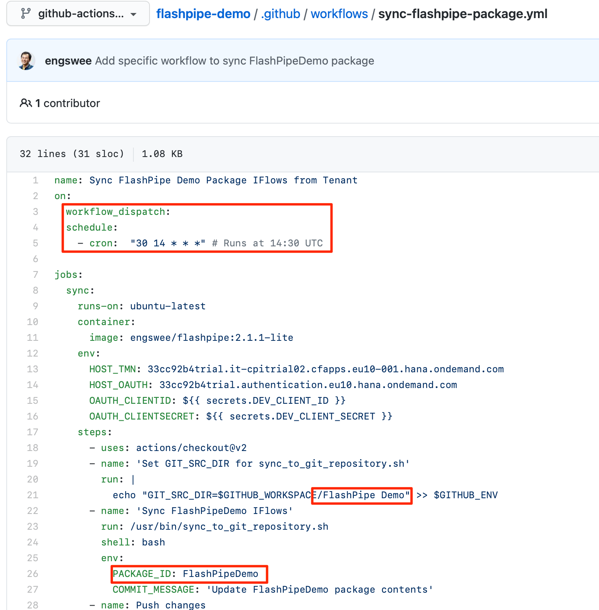

The workflow can now be triggered manually from the GitHub UI.
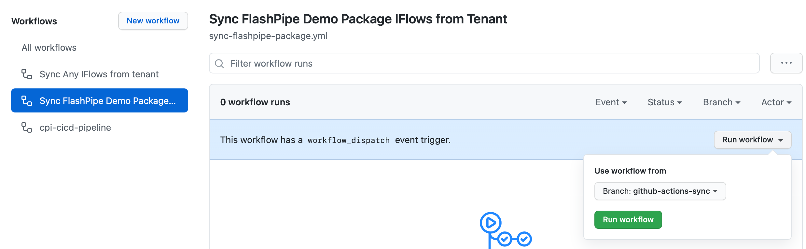

During any workflow run, ff there are no differences between the tenant content and the Git repository, no chnages will be committed.
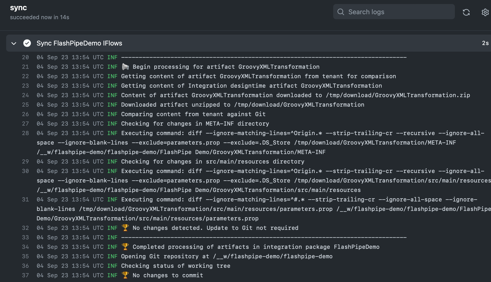

