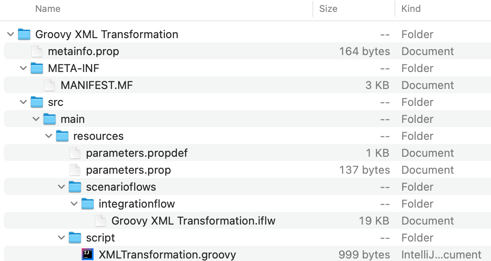
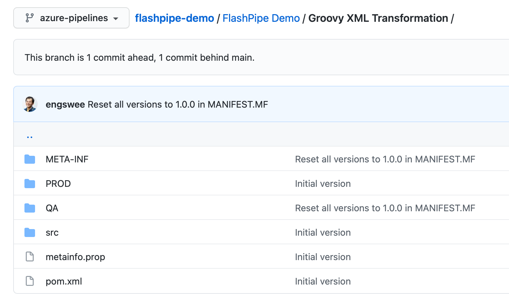
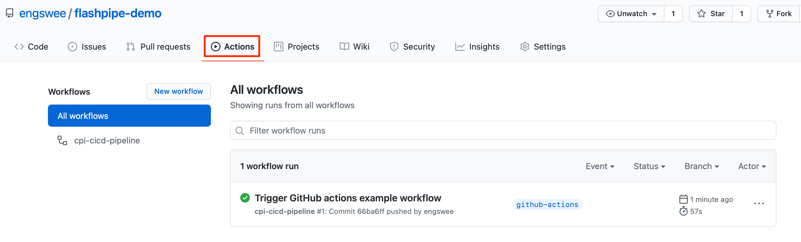
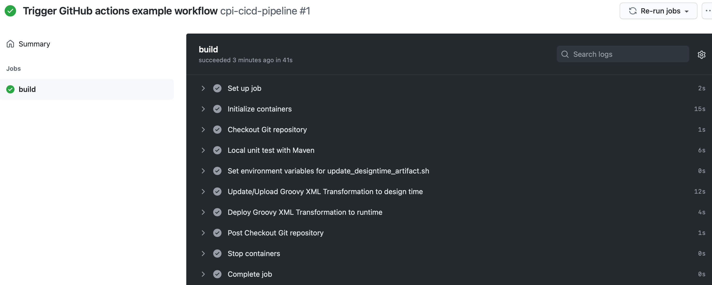

# Setting Up FlashPipe on GitHub Actions
The page describes the steps to set up _FlashPipe_ on [GitHub Actions](https://github.com/features/actions).

### 1. Download and extract content of Integration Flow
Download the content of the Integration Flow from the Cloud Integration tenant.

Extract the content of the downloaded ZIP file

### 2. Add content to Git repository
Add the contents to a new or existing Git repository.

### 3. Add Maven POM for unit testing [Optional]
If you intend to execute unit testing using Maven, add a Maven POM file (`pom.xml`) to the Git repository with the appropriate content.

_FlashPipe_'s Maven repository comes loaded with the following libraries (and any dependencies), so you can gain advantage of faster execution time by running in offline mode `mvn test -o`.
- org.codehaus.groovy:groovy-all:2.4.21
- org.spockframework:spock-core:1.3-groovy-2.4
- org.apache.camel:camel-core:2.24.2
- org.apache.httpcomponents.client5:httpclient5:5.0.4
- org.apache.logging.log4j:log4j-api:2.14.1
- org.apache.logging.log4j:log4j-core:2.14.1
- org.apache.logging.log4j:log4j-slf4j-impl:2.14.1
- net.bytebuddy:byte-buddy:1.11.0

### 4. Add GitHub Actions workflow YAML
Add a [GitHub Actions workflow YAML file](https://docs.github.com/en/actions/reference/workflow-syntax-for-github-actions) (`<workflow-name>.yml`) in the `.github/workflows` directory of the Git repository.

#### Template YAML with steps to create/update and deploy one integration artifact

Where:
- `<branch_name>` - branch name of Git repository that will automatically trigger pipeline
- `<flashpipe_version>` - version of _FlashPipe_
- `secrets.<name>` - Sensitive information are stored as encrypted secrets in GitHub and accessed using the `secrets` context. Further explanation in step 5

**Note**: Environment variables are mapped to the script's execution environment using the `env:` keyword. For variables that are dynamic expressions based on other variables, these needs to be stored into the `$GITHUB_ENV` variable prior to the script execution. An example shown above is `$GIT_DIR` which requires base path from `$GITHUB_WORKSPACE`.

#### Example (using OAuth authentication)

### 5. Create secrets in GitHub repository
Sensitive information can be stored securely on GitHub using [encrypted secrets](https://docs.github.com/en/actions/reference/encrypted-secrets). These can then be passed to the pipeline steps as environment variables. For _FlashPipe_, we will use these to securely store the details to access the Cloud Integration tenant.

In the GitHub repository, go to `Settings` > `Secrets` to create new repository secrets as shown below.

**Basic Authentication**

Create the following repository secrets.
1. `DEV_USER_ID` - user ID for Cloud Integration
2. `DEV_PASSWORD` - password for above user ID
   

**OAuth Authentication**

Create the following repository secrets.
1. `DEV_CLIENT_ID` - OAuth client ID
2. `DEV_CLIENT_SECRET` - OAuth client secret
   

**Note**: GitHub does not provide functionality to store unencrypted plain text variables, which would be useful for values like the base URLs. Optionally, these can be stored as encrypted secrets instead of being hardcoded in the YAML configuration file.

### 6. Commit/push the workflow YAML, and check pipeline run
Once all is in place, commit/push the workflow YAML. This will automatically trigger the workflow to be executed, you can monitor its execution and job logs. Go to `Actions` to view the workflows.

Upon completion of the run, you can review the logs, and also check the artifact (designtime and runtime) in the Cloud Integration tenant.
