# Setting Up OAuth Client for FlashPipe
This page describes the steps to set up an OAuth client for use with _FlashPipe_.

## Required Roles and Role-Templates
_FlashPipe_ relies heavily on access to Cloud Integration's public APIs. As such, it requires specific roles/role-templates in order to be able to access those APIs. Following are the tasks and corresponding roles/role-templates that are required.

Tasks | Role (Neo) | Role-Templates (Cloud Foundry)
------------ | ------------- | -------------
Create/edit design time artifacts | `WebToolingWorkspace.Write`, `WebToolingWorkspace.Read` | `WorkspacePackagesEdit`
Configure artifacts | `WebTooling.IntegrationFlowConfigure` | `WorkspacePackagesConfigure`
Deploy artifacts to runtime | `NodeManager.deploycontent`, `GenerationAndBuild.generationandbuildcontent` | `WorkspaceArtifactsDeploy`
Monitor runtime artifacts | `IntegrationOperationServer.read`, `NodeManager.read` | `MonitoringDataRead`
Read content protected by Access Policies |`AccessPoliciesArtifacts.AccessAll`|`AccessAllAccessPoliciesArtifacts`

## OAuth Client setup
- [OAuth Client on Cloud Foundry](#CF)
- [OAuth Client on Neo](#Neo)

##  (A) Creating an OAuth Client on Cloud Foundry
For Cloud Foundry, the default Process Integration Runtime service instance (with Plan = `api`) created using the guided Booster do not have sufficient permissions required for _FlashPipe_ to operate correctly. Therefore it is necessary to create an additional one following the steps listed below.

### 1. Logon to SAP BTP Cockpit
Access the relevant Cloud Foundry space on SAP BTP Cockpit.
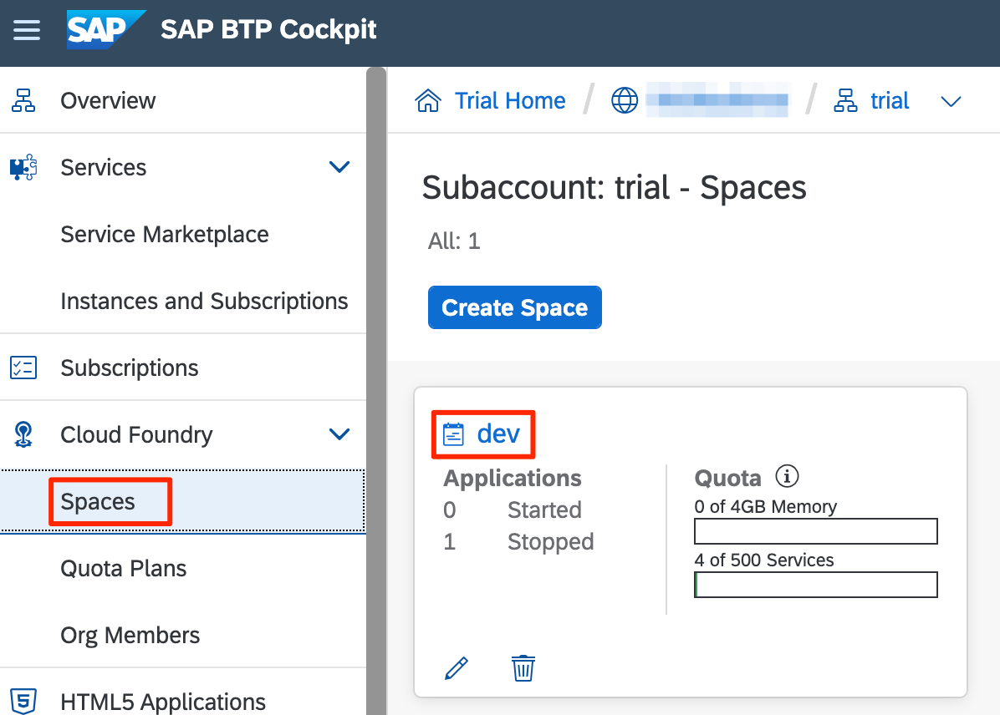

### 2. Create new service instance
In the space, navigate to the `Services > Instances` and create a new instance.
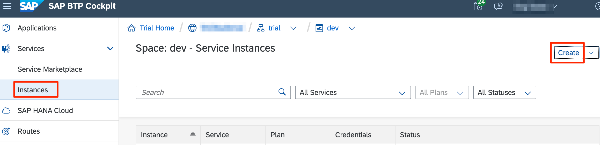

### 3. Enter instance details
To access Cloud Integration APIs, we will enter the following details for the instance.
- Service:  `Process Integration Runtime`
- Plan: `api`
- Instance Name: `flashpipe-instance`

Click `Next`.
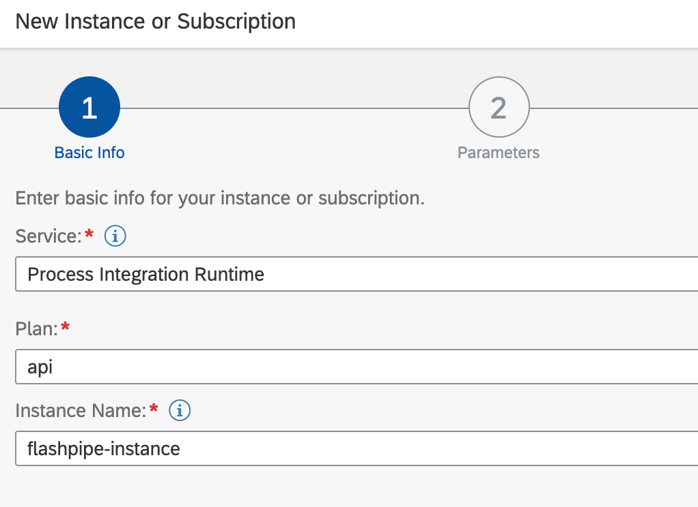

### 4. Enter required roles
Leave the default grant type to `client_credentials`. Select the roles shown below using the dropdown menu.

Click `Next`.
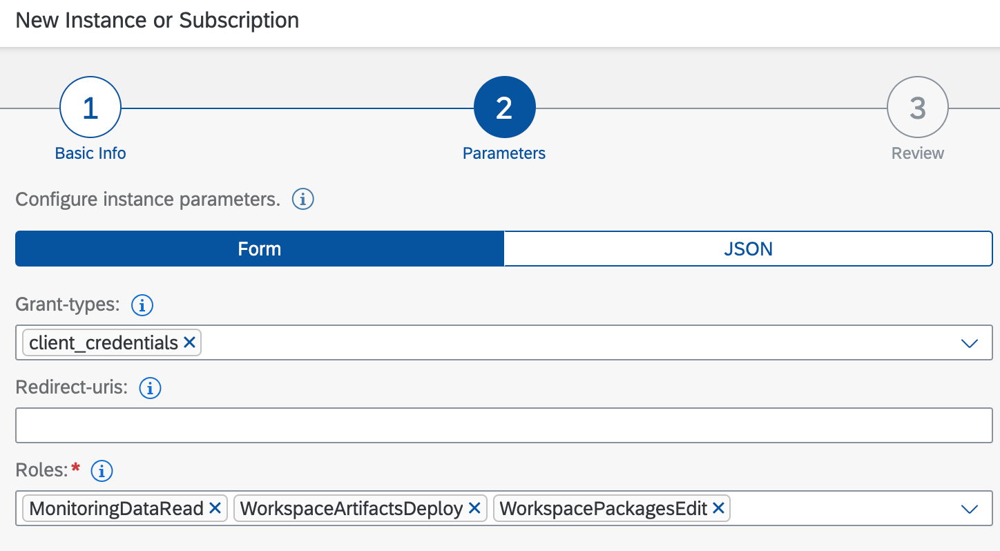

### 5. Review and create instance
Review the details and click `Create`.
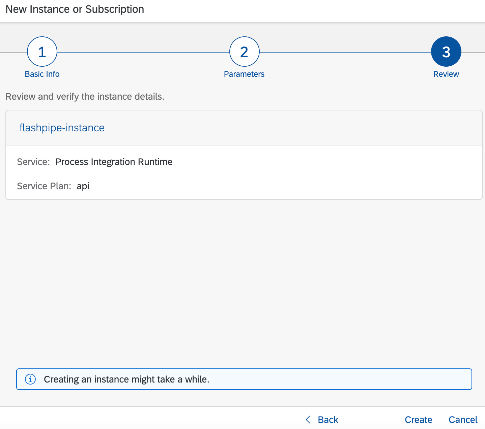

### 6. Wait for creation to complete
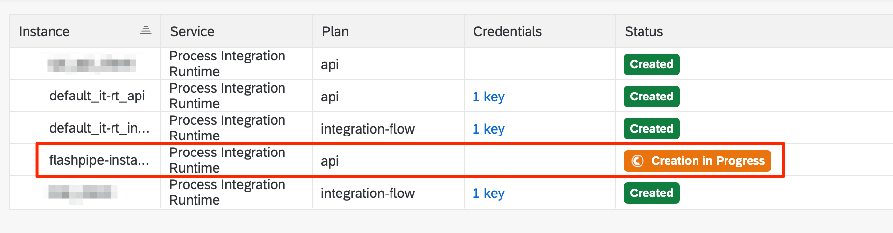

### 7. Create service key for instance
Once the instance has been create, click `***` its line and select `Create Service Key`. 
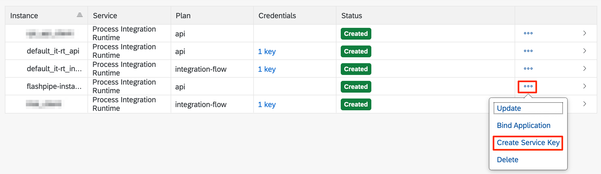

### 8. Enter name of service key
Enter `flashpipe-key` as the name of the key.
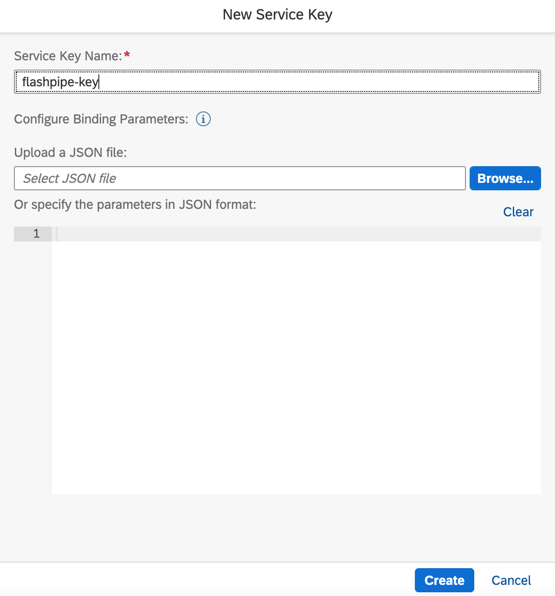

### 9. View credentials of service key
Click on the created service key to view the credentials. Copy the following fields that will be needed for configuration with _FlashPipe_.
- `clientid`
- `clientsecret`
- `tokenurl`
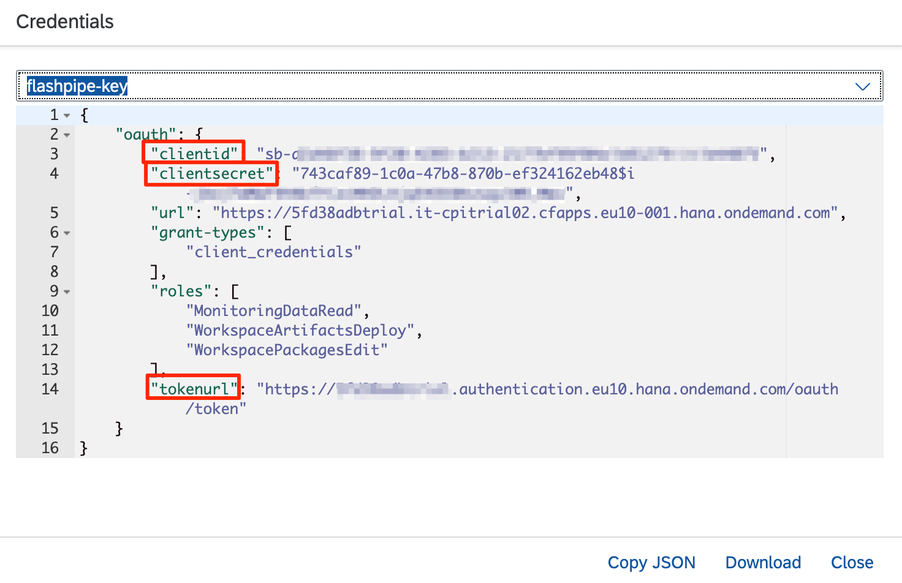

##  (B) Creating an OAuth Client on Neo

### 1. Create new OAuth client in SAP BTP Cockpit
Logon to SAP BTP Cockpit and navigate to `Security > OAuth`. Under the `Clients` tab, click `Register New Client`.

Enter the following details.
- Name: Provide a suitable name, e.g. FlashPipe_Client
- Subscription: Choose the subscription for the tenant management node, typically ending with `tmn`
- Authorization Grant: Select `Client Credentials`
- Secret: Provide a suitable value

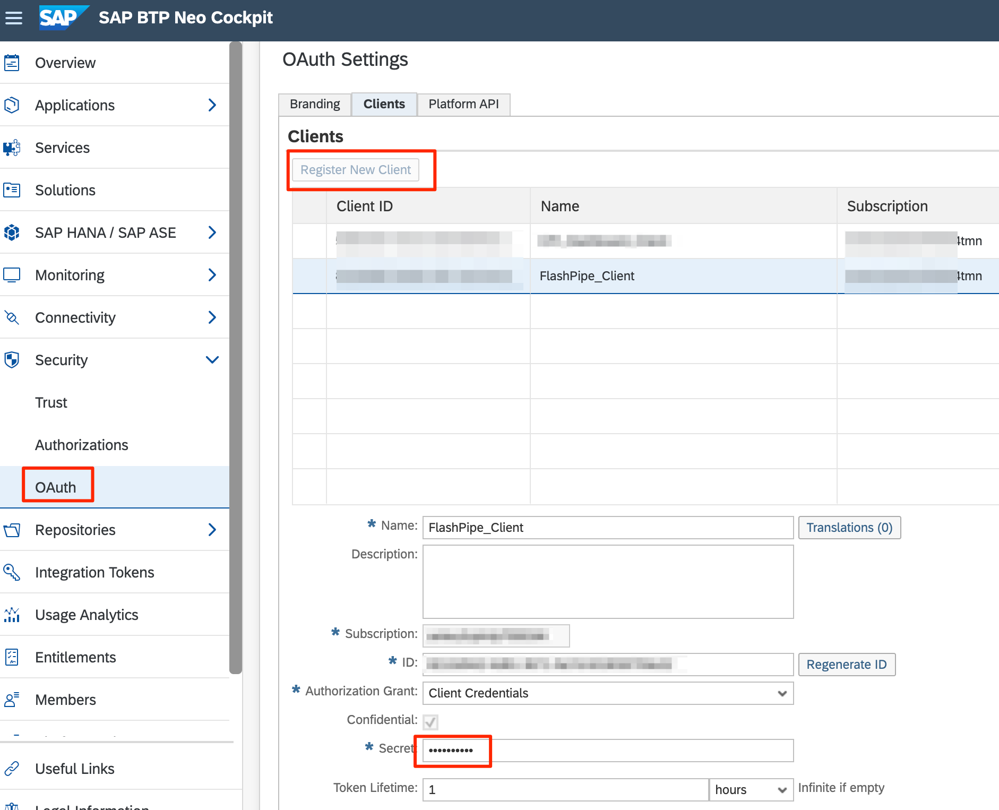

Copy the following fields that will be needed for configuration with _FlashPipe_.
- `ID`
- `Secret`

### 2. Assign roles to OAuth client
The OAuth client needs to be assigned the required roles. It is recommended to assign the roles using a group instead of direct assignment.

Navigate to `Security > Authorizations`. Under the `Groups` tab, click `New Group` and provide a suitable name, e.g. FlashPipe API Client.

Assign the group to user `oauth_client_<clientid>` where `<clientid>` is the value of the generated Client ID from step 1.

Next, assign the roles based on the roles as listed in the table at the top of this page.
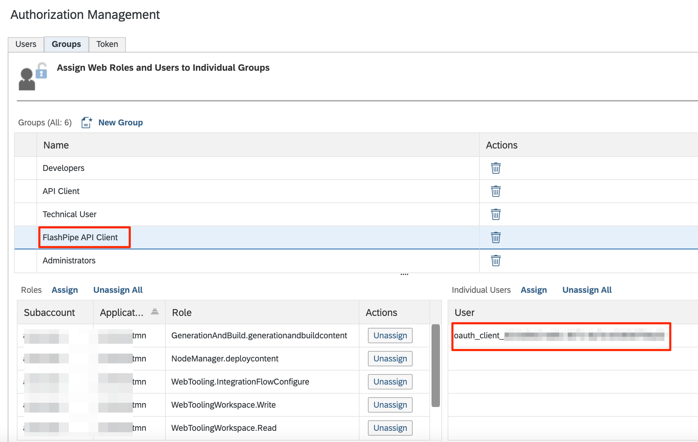

### 3. Get URL for token endpoint
Navigate back to `Security > OAuth`. Under the `Branding` tab, the token endpoint is available under the `OAuth URLs` section.
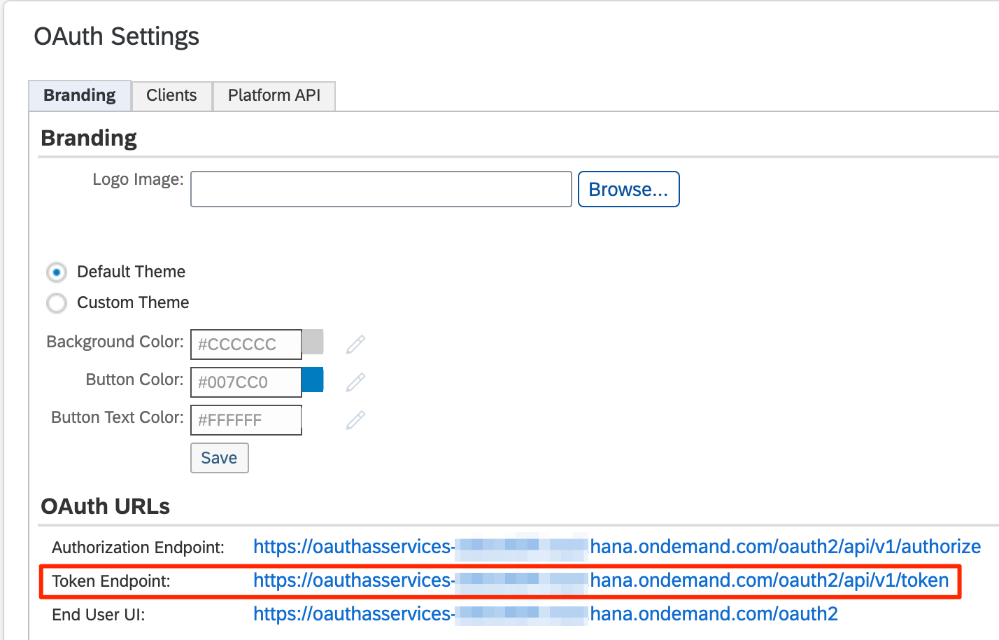

Copy the `Token Endpoint` fields that will be needed for configuration with _FlashPipe_.
