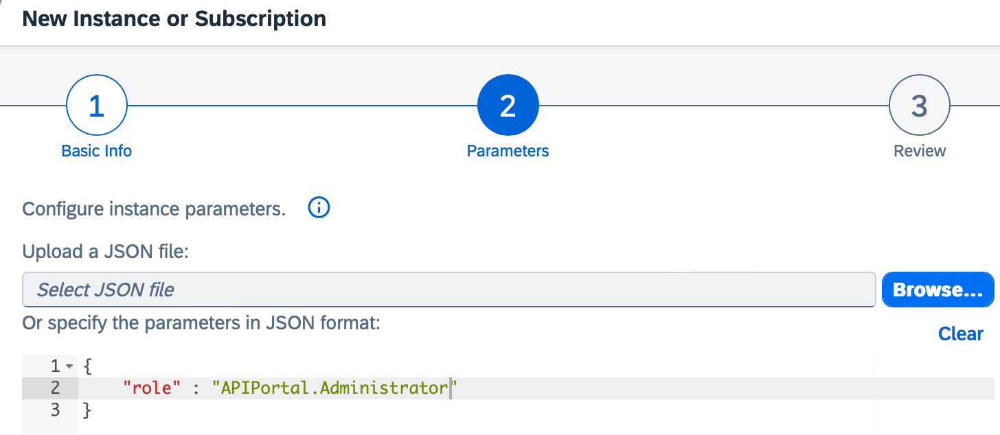
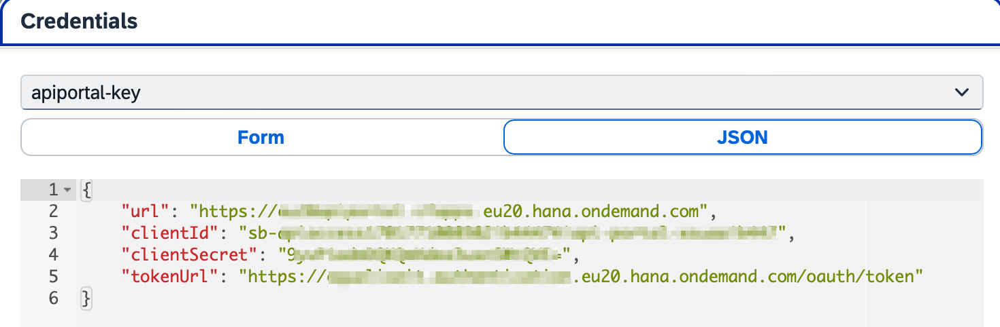

# Setting Up OAuth Client for FlashPipe
This page describes the steps to set up an OAuth client for use with _FlashPipe_.

## Required Roles and Role-Templates
_FlashPipe_ relies heavily on access to SAP Integration Suite's public APIs. As such, it requires specific roles/role-templates in order to be able to access those APIs. Following are the tasks and corresponding role-templates that are required.

| Area              | Tasks                                                | Role-Templates (Cloud Foundry)     |
|-------------------|------------------------------------------------------|------------------------------------|
| Cloud Integration | Create/edit design time artifacts                    | `WorkspacePackagesEdit`            |
| Cloud Integration | Configure artifacts                                  | `WorkspacePackagesConfigure`       |
| Cloud Integration | Deploy artifacts to runtime                          | `WorkspaceArtifactsDeploy`         |
| Cloud Integration | Monitor runtime artifacts                            | `MonitoringDataRead`               |
| Cloud Integration | Read content protected by Access Policies (Optional) | `AccessAllAccessPoliciesArtifacts` |
| API Management    | Create/edit API Portal artifacts                     | `APIPortal.Administrator`          |

### Prerequisite
In order to set up OAuth clients, the following service plans need to be assigned to the subaccount's entitlement.

| Area              | Service                     | Plan                |
|-------------------|-----------------------------|---------------------|
| Cloud Integration | Process Integration Runtime | api                 |
| API Management    | API Management, API portal  | apiportal-apiaccess |

NOTE: For Cloud Integration, the default Process Integration Runtime service instance (with Plan = `api`) created using the guided Booster does not have sufficient permissions required for _FlashPipe_ to operate correctly. Therefore it is necessary to create an additional one following the steps listed below.

## (A) Creating an OAuth Client on Cloud Foundry

### 1. Logon to SAP BTP Cockpit
Access the relevant Cloud Foundry space on SAP BTP Cockpit.

### 2. Create new service instance
In the space, navigate to the `Services > Instances` and create a new instance.

### 3. Enter instance details
Depending on the area, create a new instance based on the following details.

| Area              | Service                     | Plan                | Instance Name      |
|-------------------|-----------------------------|---------------------|--------------------|
| Cloud Integration | Process Integration Runtime | api                 | flashpipe-instance |
| API Management    | API Management, API portal  | apiportal-apiaccess | apiportal-instance |

Click `Next`.

### 4. Enter required roles

#### i) Cloud Integration
Leave the default grant type to `client_credentials`. Select the roles listed in the [roles table](#required-roles-and-role-templates) using the dropdown menu.

Click `Next`.

#### ii) API Management
Manually modify the JSON content to include the `APIPortal.Administrator` role.

Click `Next`.

### 5. Review and create instance
Review the details and click `Create`.

### 6. Wait for creation to complete

### 7. Create service key for instance
Once the instance has been create, click `***` its line and select `Create Service Key`. 

### 8. Enter name of service key
Enter `flashpipe-key` as the name of the key.

### 9. View credentials of service key
Click on the created service key to view the credentials. Copy the following fields that will be needed for configuration with _FlashPipe_.

#### i) Cloud Integration
- `clientid`
- `clientsecret`
- `tokenurl`

#### ii) API Management
- `url` - this is the host url for the management node of API Management
- `clientId`
- `clientSecret`
- `tokenUrl`

