# Simulation Testing with Maven
_FlashPipe_ includes functionality to execute simulation of an integration flow on a Cloud Integration tenant. This can be incorporated into integration tests in a Maven project. This enables testing of single or multiple steps of the design artifact of an integration flow.

The page describes the steps to incorporate _FlashPipe_'s simulation testing functionality into a Maven project, and configure a sample GitHub Actions workflow to execute the simulation testing.

> **Note**: This feature is currently only available on the Neo environment using Basic authentication.

Sample files for the examples shown below can be found in branch [github-actions-simulation](https://github.com/engswee/flashpipe-demo/tree/github-actions-simulation) of the [flashpipe-demo repository](https://github.com/engswee/flashpipe-demo).

### 1. Update Maven POM in existing Git repository
Since simulation testing involves interaction with the tenant, the intention is to execute these as integration tests in the `verify` phase using [Maven Failsafe Plugin](http://maven.apache.org/surefire/maven-failsafe-plugin/index.html).

Assuming that the integration flow(s) are already [synced to a Git repository](github-actions-sync.md), update the `pom.xml` file with the following content.

i) Add new property `skip.unit.tests` in the `properties` section of the POM.
```xml
<properties>
   ...
   <skip.unit.tests>false</skip.unit.tests>
   ...
</properties>
```

ii) Add following two dependencies in the `dependencies` section of the POM.
```xml
<dependencies>
   ...
   <dependency>
      <groupId>io.github.engswee</groupId>
      <artifactId>flashpipe</artifactId>
      <version>${flashpipe.version}</version> <!-- Replace with the latest version -->
      <scope>test</scope>
   </dependency>
   <dependency>
      <groupId>org.apache.httpcomponents.client5</groupId>
      <artifactId>httpclient5</artifactId>
      <version>5.0.4</version>
      <scope>test</scope>
   </dependency>
   ...
</dependencies>
```

iii) Add `skipTests` configuration for `maven-surefire-plugin` in `build/plugins/plugin` using property in step (i).
```xml
<build>
   <plugins>
      <plugin>
         <artifactId>maven-surefire-plugin</artifactId>
         <configuration>
            <useFile>false</useFile>
            <includes>
               <include>**/*Spec.java</include>
               <include>**/*Test.java</include>
            </includes>
            <skipTests>${skip.unit.tests}</skipTests> <!-- Add skipTests referencing property from step (i) -->
         </configuration>
      </plugin>
   </plugins>
</build>
```

iv) Add `maven-failsafe-plugin` plugin in the `build/plugins/plugin` section of the POM.
```xml
<build>
   <plugins>
      ...
      <plugin>
          <artifactId>maven-failsafe-plugin</artifactId>
          <version>2.22.2</version>
          <executions>
              <execution>
                  <goals>
                      <goal>integration-test</goal>
                      <goal>verify</goal>
                  </goals>
              </execution>
          </executions>
      </plugin>
      ...
   </plugins>
</build>
```

v) Add following GitLab repository in the `repositories` section of the POM.

This enables Maven to download the artifact which is hosted in GitLab, and not available in Maven Central.
```xml
<repositories>
  <repository>
      <id>gitlab-maven</id>
      <url>https://gitlab.com/api/v4/groups/12926885/-/packages/maven</url>
  </repository>
</repositories>
```

**Note**: For the full `pom.xml`, refer to sample [here](https://github.com/engswee/flashpipe-demo/blob/github-actions-simulation/pom.xml).

### 2. Identify simulation configuration details from integration flow
In order to run simulation, we need to define the scope of the steps which are included in the simulation. Once the scope is defined, the following details from the integration flow are required for configuration of the simulation test:
1) Start Point
2) End Point
3) Process Name

The following integration flow provides an example of the details required.
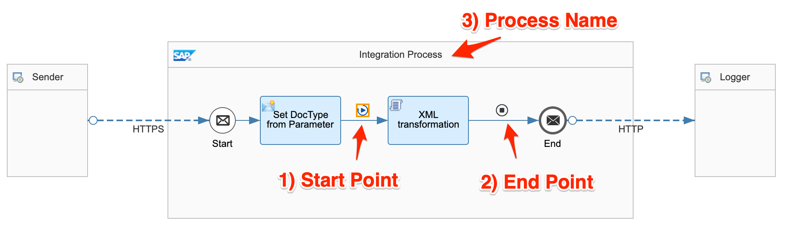

In order to retrieve the details of each part, select each part and click on the technical information button (button with i in a circle).

Select the connecting arrow into the first step, and get the `Start Point`.
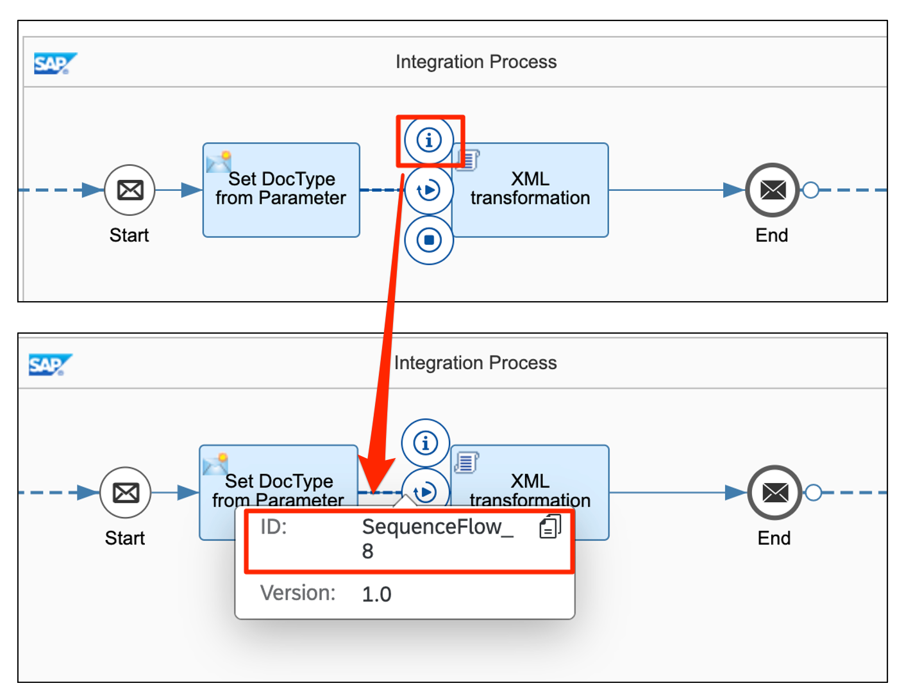

Select the connecting arrow out of the last step, and get the `End Point`.
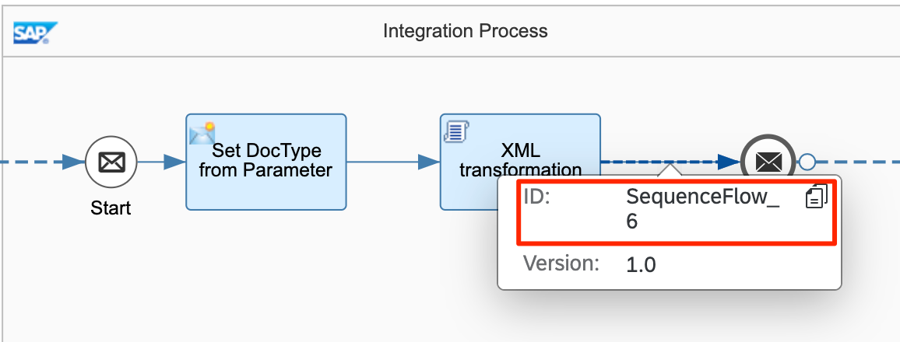

Select the process which contains the steps, and get the `Process Name`.
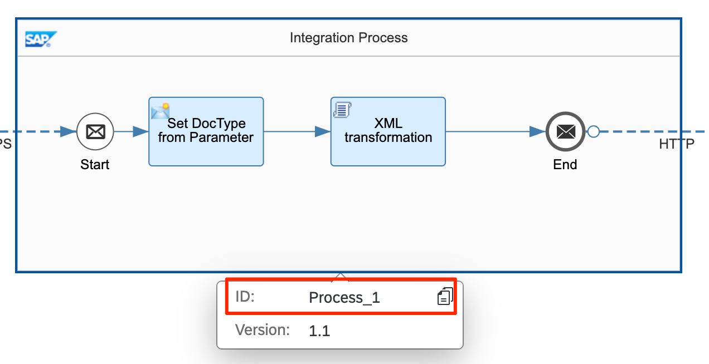

### 3. Create Simulation Tests using TestCaseRunner
_FlashPipe_ provides class `io.github.engswee.flashpipe.cpi.simulation.TestCaseRunner` that enables easy creation of simulation test cases using configuration files, together with input and expected output files.

Firstly, we create the following files in the `src/test/resources` directory.
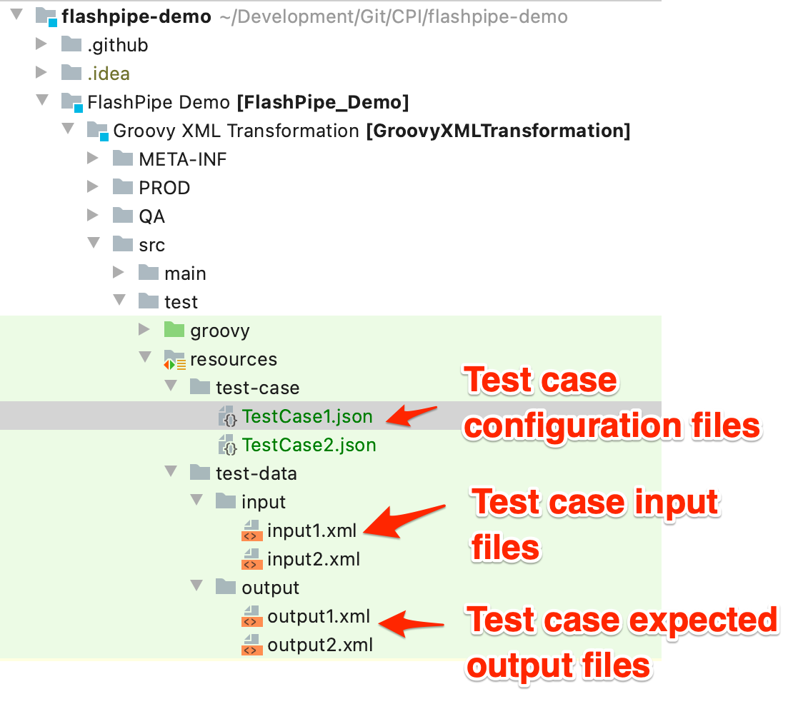

i) Create test case configuration file `TestCase1.json` in `src/test/resources/test-case` directory using the content below.

Configure the simulation test case by using the simulation details from step 2, and providing the relative path to the input and expected output resources files.

```json
{
    "TestCase": {
        "Name": "XML Mapping Scenario 1",
        "IFlowID": "GroovyXMLTransformation",
        "StartPoint": "SequenceFlow_8",
        "EndPoint": "SequenceFlow_6",
        "Process": "Process_1",
        "Input": {
            "Headers": {},
            "Properties": {},
            "Body": "/test-data/input/input1.xml"
        },
        "ExpectedOutput": {
            "Headers": {},
            "Properties": {},
            "Body": "/test-data/output/output1.xml"
        }
    }
}
```

ii) Create the test case input file `input1.xml` in `src/test/resources/test-data/input` directory using the content below.
```xml
<Order>
    <Header>
        <OrderNumber>ORD60001</OrderNumber>
        <Date>20190218</Date>
    </Header>
    <Item>
        <ItemNumber>10</ItemNumber>
        <MaterialNumber>MT70001</MaterialNumber>
        <Quantity>57</Quantity>
        <Valid>true</Valid>
    </Item>
    <Item>
        <ItemNumber>20</ItemNumber>
        <MaterialNumber>MT80001</MaterialNumber>
        <Quantity>28</Quantity>
        <Valid>false</Valid>
    </Item>
</Order>
```

iii) Create the test case expected output file `output1.xml` in `src/test/resources/test-data/output` directory using the content below.
```xml
<PurchaseOrder>
    <Header>
        <ID>ORD60001</ID>
        <DocumentDate>2019-02-18</DocumentDate>
    </Header>
    <Item>
        <ItemNumber>010</ItemNumber>
        <ProductCode>MT70001</ProductCode>
        <Quantity>57</Quantity>
    </Item>
</PurchaseOrder>
```

Next, create a Spock specification class in `src/test/groovy` directory.
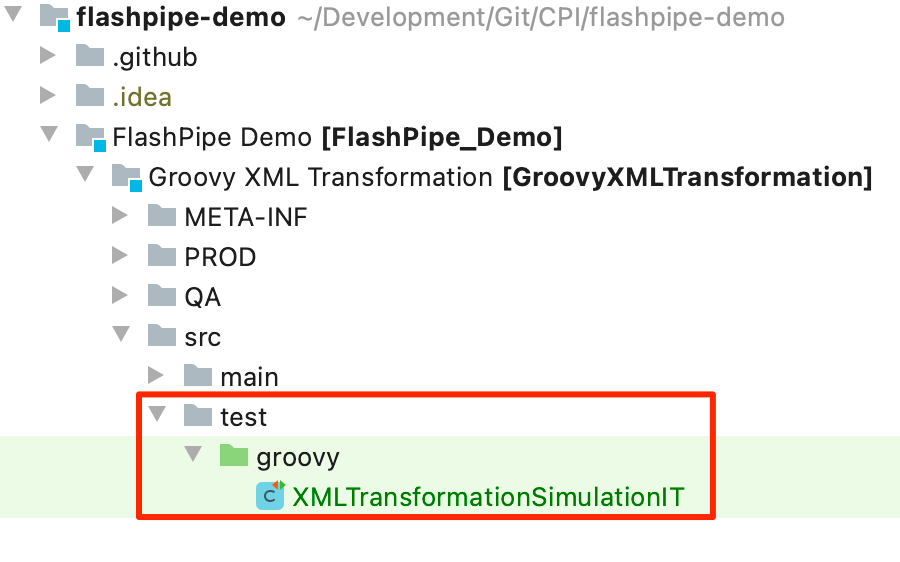

Replace the content of the class with the template code below.
```groovy
import groovy.json.JsonSlurper
import io.github.engswee.flashpipe.cpi.simulation.TestCaseRunner
import spock.lang.Shared
import spock.lang.Specification
import spock.lang.Unroll

class XMLTransformationSimulationIT extends Specification {
    @Shared
    TestCaseRunner testCaseRunner

    def setupSpec() {
        def host = System.getenv('HOST_TMN')
        def user = System.getenv('BASIC_USERID')
        def password = System.getenv('BASIC_PASSWORD')
        testCaseRunner = new TestCaseRunner(host, user, password)
    }

    @Unroll
    def 'Simulation Test: #testCaseName'() {
        when:
        testCaseRunner.run(TestCaseContentFile)
        Map expectedHeaders = testCaseRunner.getExpectedOutputHeaders()
        Map expectedProperties = testCaseRunner.getExpectedOutputProperties()
        String expectedBody = testCaseRunner.getExpectedOutputBody()

        then:
        verifyAll {
            // Headers
            if (expectedHeaders.size() > 0) {
                expectedHeaders.each { k, v ->
                    assert testCaseRunner.getActualOutputHeaders().get(k) == v
                }
            }
            // Properties
            if (expectedProperties.size() > 0) {
                expectedProperties.each { k, v ->
                    assert testCaseRunner.getActualOutputProperties().get(k) == v
                }
            }
            // Body
            if (expectedBody)
                testCaseRunner.getActualOutputBody() == expectedBody
        }

        where:
        TestCaseContentFile         | _
        '/test-case/TestCase1.json' | _

        testCaseName = new JsonSlurper().parse(this.getClass().getResource(TestCaseContentFile)).TestCase.Name
    }
}
```

**Note**: For new test cases, once the corresponding test case configuration, input and expected output files are defined, adding the test case can easily be done by adding an extra line in the `where` section, as shown below.
```groovy
  where:
  TestCaseContentFile         | _
  '/test-case/TestCase1.json' | _
  '/test-case/TestCase2.json' | _
```

### 4. Create Simulation Tests using Simulator
_FlashPipe_ provides class `io.github.engswee.flashpipe.cpi.simulation.Simulator` that can be used to developed fine-grained simulation tests. These can be useful when the file-to-file comparison (used by `TestCaseRunner`) is not suitable, for example having to deal with the raw content of the simulation response output.

`Simulator` provides the following **simulate** method to execute a simulation test.

> public Map **simulate**(byte[] inputBody, String iFlowId, String startPoint, String endPoint, String processName, Map inputHeaders, Map inputProperties)
> 
> **Parameters:**
> - _inputBody_ - body of input to simulation in byte array
> - _iFlowId_ - ID of the integration flow
> - _startPoint_ - technical ID of the start point of simulation
> - _endPoint_ - technical ID of the end point of simulation
> - _processName_ - technical ID of the process name which contains the steps
> - _inputHeaders_ - headers of input to simulation in a Map
> - _inputProperties_ - properties of input to simulation in a Map
>
> **Returns:**
>
> Output results of simulation in a Map with the following keys:
>   - _body_
>   - _headers_
>   - _properties_

Using the following integration flow as an example, a simulation test using `Simulator` will be created to test the message mapping step.
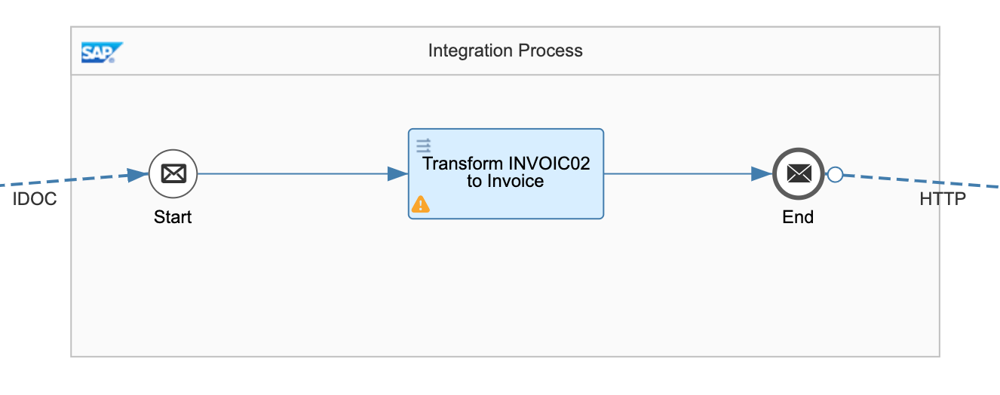
Following are the key details for the simulation configuration:
1) Start Point = `SequenceFlow_3`
2) End Point = `SequenceFlow_9`
3) Process Name = `Process_1`

We create a Spock specification class in the `src/test/groovy` directory.
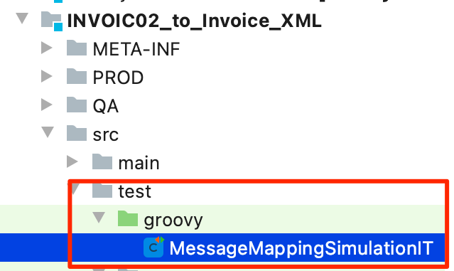

Replace the content of the class with the code below. In this test, the actual output is parsed and only certain nodes are validated instead of the whole payload.
```groovy
import io.github.engswee.flashpipe.cpi.simulation.Simulator
import io.github.engswee.flashpipe.http.HTTPExecuter
import io.github.engswee.flashpipe.http.HTTPExecuterApacheImpl
import spock.lang.Shared
import spock.lang.Specification

class MessageMappingSimulationIT extends Specification {
    @Shared
    Simulator simulator

    def setupSpec() {
        def host = System.getenv('HOST_TMN')
        def user = System.getenv('BASIC_USERID')
        def password = System.getenv('BASIC_PASSWORD')
        HTTPExecuter httpExecuter = HTTPExecuterApacheImpl.newInstance('https', host, 443, user, password)
        simulator = new Simulator(httpExecuter)
    }

    def 'Test Message mapping'() {
        when:
        Map outputMessage = simulator.simulate(this.class.getResource('/test-data/input.xml').getBytes(), 'INVOIC02_Message_Mapping', 'SequenceFlow_3', 'SequenceFlow_9', 'Process_1', [:], [:])

        then:
        def root = new XmlSlurper().parse(new ByteArrayInputStream(outputMessage.body as byte[]))
        verifyAll {
            root.Header.InvoiceNo.text() == '1234567890'
            root.Header.Currency.text() == 'USD'
            root.Header.PaymentTerms.text() == 'NT30'
            root.Items.size() == 3
            root.Items[0].Quantity.text() == '30.000'
            root.Items[1].Quantity.text() == '15.000'
            root.Items[2].Quantity.text() == '25.000'
        }
    }
}
```

Next create input file `input.xml` in the `src/test/resources/test-data` directory, using the content from [here](https://github.com/engswee/flashpipe-demo/blob/github-actions-simulation/FlashPipe%20Demo/INVOIC02_to_Invoice_XML/src/test/resources/test-data/input.xml).
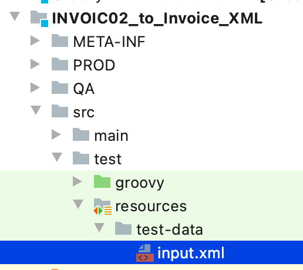

### 5. Add Maven step to GitHub Actions workflow YAML
To execute the simulation tests, add the following step in the workflow to execute Maven's `verify` phase which will execute the simulations as integration tests. The step should be after the corresponding `/usr/bin/update_designtime_artifact.sh` to ensure the design artifact is updated prior to simulation.

```yaml
- name: 'Simulation test with Maven'
  run: mvn clean verify -Dskip.unit.tests -s /usr/share/maven/ref/settings-docker.xml
```

As we are using Maven Failsafe Plugin to execute integration tests, all test sources with their name ending with `IT` will be executed. Additionally the `skip.unit.tests` is set to prevent unit tests from being executed again (assuming these were already executed in a previous step of the workflow).

**Note**: For the workflow file, refer to sample [here](https://github.com/engswee/flashpipe-demo/blob/github-actions-simulation/.github/workflows/cpi-cicd-pipeline.yml).

### 6. [Optional] Create secrets in GitHub repository
If the credentials to access the tenant have not been configured, add them as secrets in the GitHub repository.

In the GitHub repository, go to `Settings` > `Secrets` to create new repository secrets.

Create the following repository secrets for Basic Authentication.
1. `NEO_USER_ID` - user ID for Cloud Integration
2. `NEO_PASSWORD` - password for above user ID
   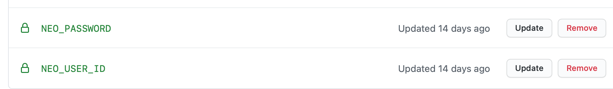

### 7. Commit changes and check workflow run
Once all is in place, commit the changes. This will automatically trigger the workflow to be executed, and you can monitor its execution and job logs. Go to `Actions` to view the workflows.
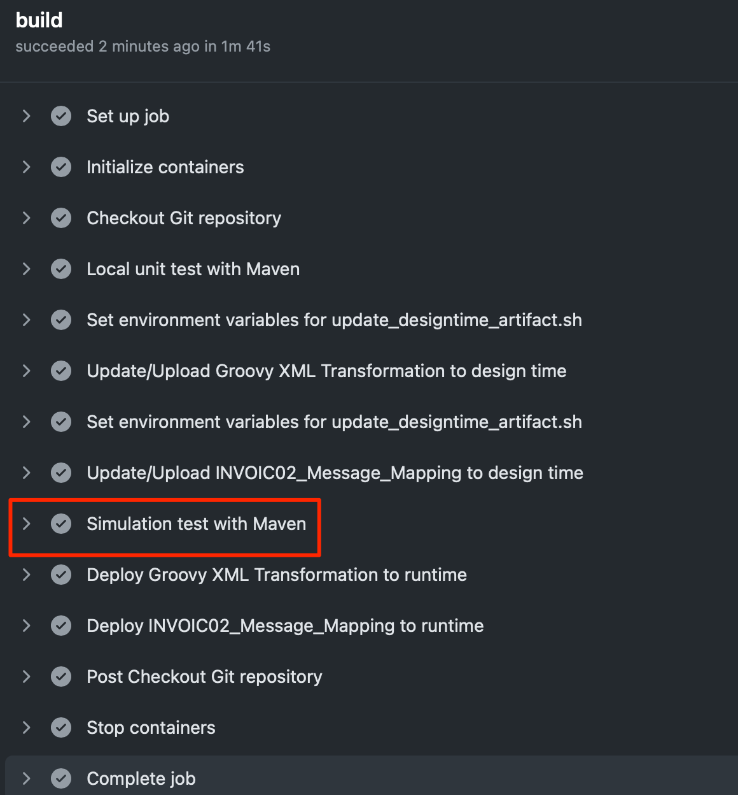

Expand the logs for the `Simulation test with Maven` step to view the execution of the following:
- `XMLTransformationSimulationIT` (based on `TestCaseRunner`)
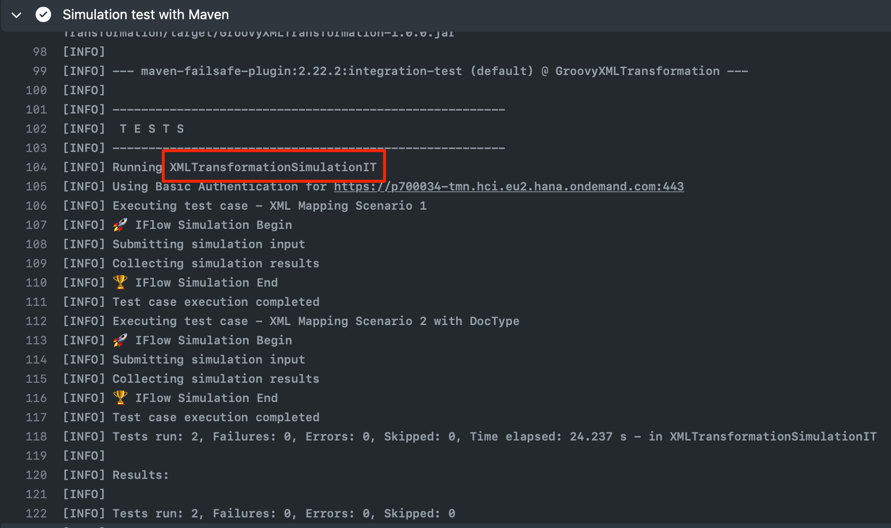

- `MessageMappingSimulationIT` (based on `Simulator`)
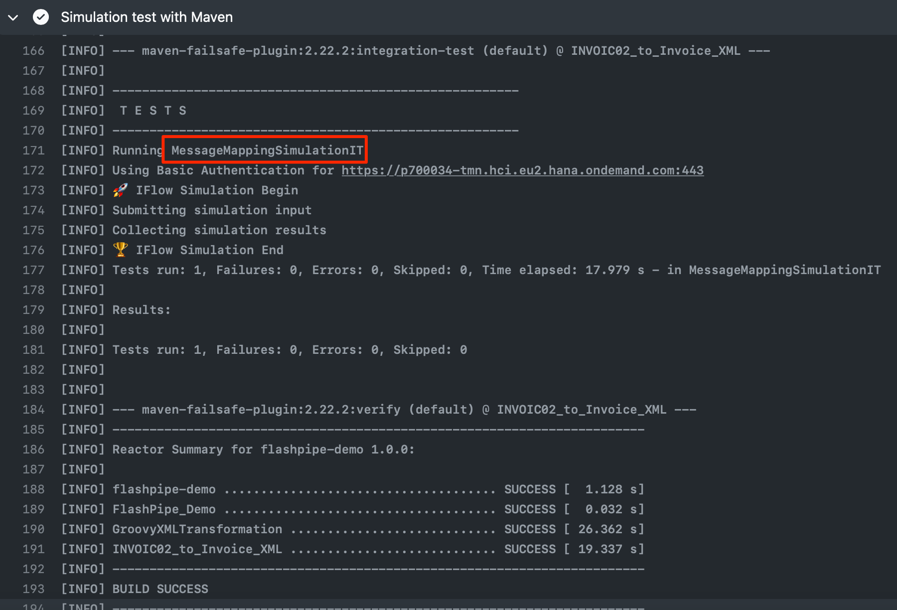